# Tsuki's Rhythm Game

## Challenge Description

Tsuki is a cryptocurrency enthusiast and the lead developer of a community rhythm game. Recently, she was testing mods and new beatmaps created by players for the game. However, a few days later, she was shocked to discover that her wallet had been completely drained.

Currently, the security response team has extracted a network traffic capture from Tsuki's work computer, along with the entire game folder of the rhythm game. Please conduct a digital forensic analysis on them.

## Given Files

The handout contains 3 files:

- `Evidence.zip` — password protected
- `Game.zip` — the rhythm game folder
- `traffic.pcapng` — network capture from Tsuki's machine

Extracting `Game.zip` reveals:

```
Game/
├── charts/
├── mods/
└── TsukiRhythmGame.exe   (25,400 KB)
```

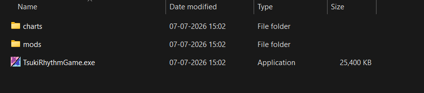

---

## Question 1 — MD5 hash of the main executable

**Question:** What is the MD5 hash of the main executable of the rhythm game downloaded by the victim?

**Answer:** `1eeb9c6ed21903f22e1b28dbcbc5c01c`

### Solution

Opening `traffic.pcapng` in Wireshark, filter:

```
http.request.uri contains ".exe"
```

Two exe downloads are visible — `TsukiRhythmGame.exe` (26 MB from `192.168.117.1:3000`) and `Updater.exe` (268 KB from `192.168.117.1:8000`).

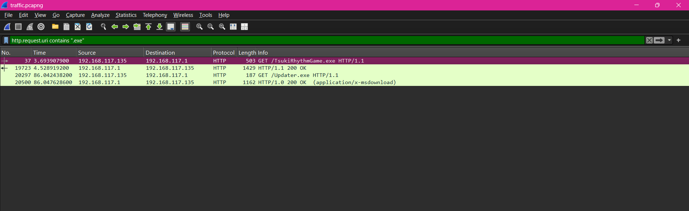

Go to **File → Export Objects → HTTP**, select `TsukiRhythmGame.exe` and save it.

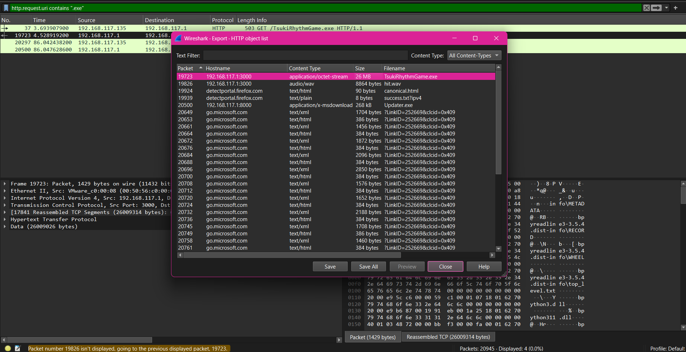

Verify the hash:

```
certutil -hashfile TsukiRhythmGame.exe MD5
```

Output confirms: `1eeb9c6ed21903f22e1b28dbcbc5c01c`

---

## Question 2 — AES Key and IV used to encrypt/decrypt beatmaps

**Question:** What are the Key and IV used by the rhythm game to encrypt and decrypt the beatmaps?

**Answer:** `TsukiRhythmKey!!_TsukiRhythmIV!!!`

### Solution

Opening `TsukiRhythmGame.exe` in IDA shows Python API strings (`Py_PreInitialize`, `PyConfig_Clear`, etc.), confirming the binary is a PyInstaller-packed Python application.

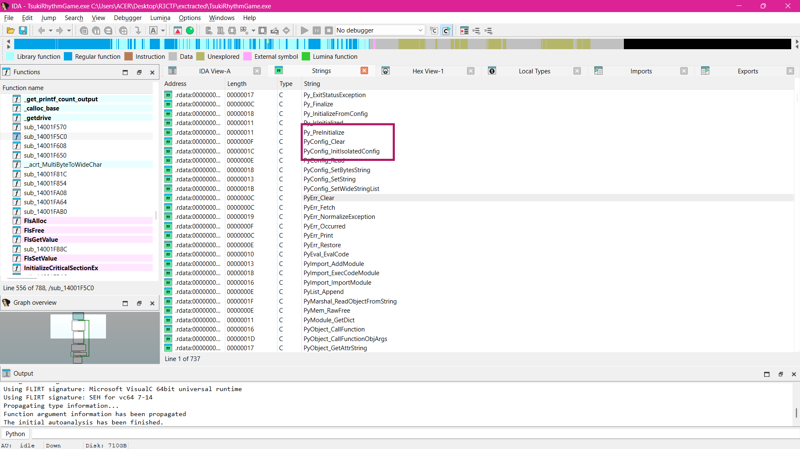

Extract the bundled `.pyc` files using `pyinstxtractor-ng`:

```
python -m pyinstxtractor_ng "C:\Users\ACER\Desktop\R3CTF\Game\TsukiRhythmGame.exe"
```

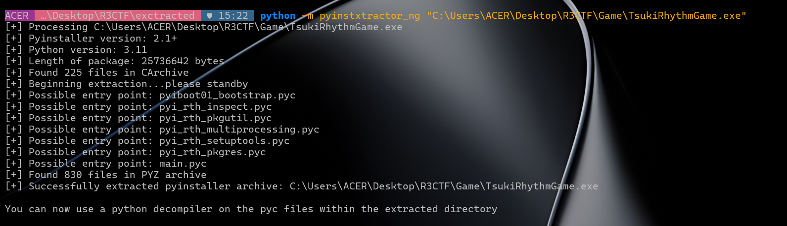

Upload `main.pyc` (Python 3.11) to [pylingual.io](https://pylingual.io) to decompile it. Lines 23–24 reveal hardcoded AES constants:

```python
AES_KEY = b'TsukiRhythmKey!!'
AES_IV = b'TsukiRhythmIV!!!'
```

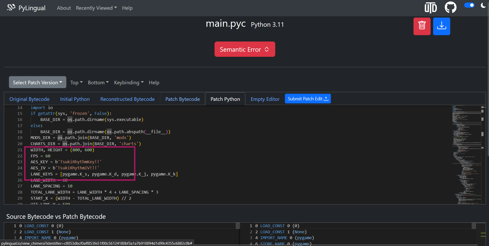

<details>
<summary>Full decompiled main.py</summary>

```python
# Decompiled with PyLingual (https://pylingual.io)
# Internal filename: 'main.py'
# Bytecode version: 3.11a7e (3495)
# Source timestamp: 1970-01-01 00:00:00 UTC (0)

import pygame
import os
import sys
import json
import importlib.util
from Crypto.Cipher import AES
from Crypto.Util.Padding import unpad
import base64
import io
if getattr(sys, 'frozen', False):
    BASE_DIR = os.path.dirname(sys.executable)
else:
    BASE_DIR = os.path.dirname(os.path.abspath(__file__))
MODS_DIR = os.path.join(BASE_DIR, 'mods')
CHARTS_DIR = os.path.join(BASE_DIR, 'charts')
WIDTH, HEIGHT = (800, 600)
FPS = 60
AES_KEY = b'TsukiRhythmKey!!'
AES_IV = b'TsukiRhythmIV!!!'
LANE_KEYS = [pygame.K_s, pygame.K_d, pygame.K_j, pygame.K_k]
LANE_WIDTH = 60
LANE_SPACING = 10
TOTAL_LANE_WIDTH = LANE_WIDTH * 4 + LANE_SPACING * 3
START_X = (WIDTH - TOTAL_LANE_WIDTH) // 2
HIT_LINE_Y = 500
SCROLL_TIME = 1500
JUDGE_WINDOWS = {'Perfect': 50, 'Great': 100, 'Good': 150}
BASE_DIR = ''
loaded_mods = []
local_leaderboard = []
def load_mods():
    if not os.path.exists(MODS_DIR):
        return None
    else:
        for f in os.listdir(MODS_DIR):
            if f.endswith('.tsukimod'):
                mod_path = os.path.join(MODS_DIR, f)
                if mod_path not in sys.path:
                    sys.path.insert(0, mod_path)
                mod_module_name = f.replace('.tsukimod', '_main')
                try:
                    mod = importlib.import_module(mod_module_name)
                    if hasattr(mod, 'init'):
                        mod.init()
                    loaded_mods.append(mod)
                    print(f'[+] Loaded Mod: {f}')
                except Exception as e:
                    print(f'[-] Failed to load {f}: {e}')
def decrypt_chart(file_path):
    with open(file_path, 'rb') as f:
        ciphertext = f.read()
    cipher = AES.new(AES_KEY, AES.MODE_CBC, AES_IV)
    plaintext = unpad(cipher.decrypt(ciphertext), AES.block_size)
    return json.loads(plaintext.decode('utf-8'))
def trigger_judgement_hook(judgement, lane):
    x_center = START_X + lane * (LANE_WIDTH + LANE_SPACING) + LANE_WIDTH // 2
    y_pos = HIT_LINE_Y - 20
    for mod in loaded_mods:
        if hasattr(mod, 'on_judgement'):
            mod.on_judgement(judgement, lane, x_center, y_pos)
def main():
    # irreducible cflow, using cdg fallback
    # ***<module>.main: Failure: Different control flow
    pygame.init()
    screen = pygame.display.set_mode((WIDTH, HEIGHT))
    pygame.display.set_caption('Tsuki\'s Rhythm Game')
    font_large = pygame.font.Font(None, 48)
    font_medium = pygame.font.Font(None, 36)
    font_small = pygame.font.Font(None, 24)
    clock = pygame.time.Clock()
    load_mods()
    charts = [f for f in os.listdir(CHARTS_DIR) if f.endswith('.tsuki')] if os.path.exists(CHARTS_DIR) else []
    loaded_charts = []
    print('[System] Loading charts...')
    if os.path.exists(CHARTS_DIR):
        for f in os.listdir(CHARTS_DIR):
            if f.endswith('.tsuki'):
                try:
                    c_data = decrypt_chart(os.path.join(CHARTS_DIR, f))
                    cover_b64 = c_data.get('cover_data', '')
                    if cover_b64:
                        img_bytes = base64.b64decode(cover_b64)
                        img_stream = io.BytesIO(img_bytes)
                        c_data['cover_surface'] = pygame.transform.scale(pygame.image.load(img_stream), (250, 250))
                    else:
                        c_data['cover_surface'] = None
                    loaded_charts.append(c_data)
                    print(f"Loaded chart: {c_data.get('title')}")
                except Exception as e:
                    print(f'[-] Failed to load {f}: {e}')
    state, sel_idx = ('MENU', 0)
    chart_data = None
    active_notes = []
    lane_pressed = [False, False, False, False]
    combo = 0
    score = 0
    start_ticks = 0
    running = True
    while running:
        current_time = pygame.time.get_ticks() - start_ticks if state == 'PLAYING' else 0
        screen.fill((20, 20, 20))
        for event in pygame.event.get():
            if event.type == pygame.QUIT:
                running = False
            if state == 'MENU':
                if event.type == pygame.KEYDOWN:
                    if event.key == pygame.K_UP:
                        sel_idx = (sel_idx - 1) % len(charts) if charts else 0
                        if event.key == pygame.K_DOWN:
                            sel_idx = (sel_idx + 1) % len(charts) if charts else 0
                            if event.key == pygame.K_RETURN and charts:
                                selected_file = charts[sel_idx]
                                chart_path = os.path.join(CHARTS_DIR, selected_file)
                                try:
                                    chart_data = decrypt_chart(chart_path)
                                    active_notes = [n for n in chart_data.get('notes', []) if n.get('type', 1)!= 99]
                                    active_notes.sort(key=lambda x: x['time'])
                                    audio_b64 = chart_data.get('audio_data')
                                    if audio_b64:
                                        if not pygame.mixer.get_init():
                                            pygame.mixer.init()
                                        pygame.mixer.music.unload()
                                        audio_bytes = base64.b64decode(audio_b64)
                                        audio_stream = io.BytesIO(audio_bytes)
                                        pygame.mixer.music.load(audio_stream, 'mp3')
                                        pygame.mixer.music.play()
                                    else:
                                        print(f'[警告] 谱面 {selected_file} 中未找到音频数据！')
                                    combo = 0
                                    score = 0
                                    start_ticks = pygame.time.get_ticks()
                                    state = 'PLAYING'
                                    print(f"[System] Started: {chart_data.get('title', selected_file)}")
                                except Exception as e:
                                    print(f'[错误] 加密谱面加载失败: {e}')
                if state == 'PLAYING':
                    if event.type == pygame.KEYDOWN:
                        if event.key == pygame.K_ESCAPE:
                            pygame.mixer.music.stop()
                            pygame.mixer.music.unload()
                            for mod in loaded_mods:
                                if hasattr(mod, 'on_game_end'):
                                    mod.on_game_end(chart_data, local_leaderboard)
                            state = 'MENU'
                        else:
                            if event.key in LANE_KEYS:
                                lane = LANE_KEYS.index(event.key)
                                lane_pressed[lane] = True
                                for mod in loaded_mods:
                                    if hasattr(mod, 'on_hit'):
                                        mod.on_hit(lane)
                                for note in active_notes:
                                    if note['lane'] == lane and (not note.get('hit', False)):
                                        time_diff = abs(current_time - note['time'])
                                        if time_diff <= JUDGE_WINDOWS['Good']:
                                            note['hit'] = True
                                            if time_diff <= JUDGE_WINDOWS['Perfect']:
                                                judgement = 'Perfect'
                                                score += 1000
                                            else:
                                                if time_diff <= JUDGE_WINDOWS['Great']:
                                                    judgement = 'Great'
                                                    score += 500
                                                else:
                                                    judgement = 'Good'
                                                    score += 100
                                            combo += 1
                                            trigger_judgement_hook(judgement, lane)
                                            break
                        if event.type == pygame.KEYUP:
                            if event.key in LANE_KEYS:
                                lane_pressed[LANE_KEYS.index(event.key)] = False
        if state == 'MENU':
            screen.blit(font_large.render('TSUKI RHYTHM', True, (255, 255, 255)), (50, 50))
            if not loaded_charts:
                screen.blit(font_medium.render('No charts found in /charts folder.', True, (150, 150, 150)), (50, 150))
            else:
                list_start_y = 150
                item_height = 45
                for idx, c in enumerate(loaded_charts):
                    is_selected = idx == sel_idx
                    if is_selected:
                        selection_rect = pygame.Rect(40, list_start_y + idx * item_height - 5, 400, item_height - 5)
                        pygame.draw.rect(screen, (60, 60, 80), selection_rect)
                        pygame.draw.rect(screen, (255, 255, 100), selection_rect, 2)
                        text_color = (255, 255, 100)
                        prefix = '>> '
                    else:
                        text_color = (150, 150, 150)
                        prefix = '   '
                    display_text = f"{prefix}{c.get('title', 'Unknown')} - {c.get('artist', 'Unknown')}"
                    text_surface = font_medium.render(display_text, True, text_color)
                    screen.blit(text_surface, (50, list_start_y + idx * item_height))
                current_c = loaded_charts[sel_idx]
                preview_x = WIDTH - 300
                preview_y = 150
                if current_c.get('cover_surface'):
                    screen.blit(current_c['cover_surface'], (preview_x, preview_y))
                    pygame.draw.rect(screen, (255, 255, 255), (preview_x, preview_y, 250, 250), 3)
                else:
                    pygame.draw.rect(screen, (40, 40, 40), (preview_x, preview_y, 250, 250))
                    screen.blit(font_small.render('NO PREVIEW', True, (100, 100, 100)), (preview_x + 80, preview_y + 110))
                detail_y = preview_y + 270
                title_txt = font_small.render(f"Title: {current_c.get('title')}", True, (255, 255, 255))
                artist_txt = font_small.render(f"Artist: {current_c.get('artist')}", True, (200, 200, 200))
                screen.blit(title_txt, (preview_x, detail_y))
                screen.blit(artist_txt, (preview_x, detail_y + 25))
        else:
            if state == 'PLAYING':
                for i in range(4):
                    x = START_X + i * (LANE_WIDTH + LANE_SPACING)
                    color = (50, 50, 50) if not lane_pressed[i] else (120, 120, 120)
                    pygame.draw.rect(screen, color, (x, 0, LANE_WIDTH, HEIGHT))
                    key_color = (200, 200, 200) if not lane_pressed[i] else (255, 255, 255)
                    pygame.draw.rect(screen, key_color, (x, HIT_LINE_Y, LANE_WIDTH, 20))
                    key_char = font_medium.render(pygame.key.name(LANE_KEYS[i]).upper(), True, (0, 0, 0))
                    screen.blit(key_char, (x + 20, HIT_LINE_Y - 2))
                pygame.draw.line(screen, (255, 255, 255), (START_X, HIT_LINE_Y), (START_X + TOTAL_LANE_WIDTH - LANE_SPACING, HIT_LINE_Y), 3)
                all_processed = True
                for note in active_notes:
                    if note.get('hit', False):
                        continue
                    all_processed = False
                    time_diff = current_time - note['time']
                    if time_diff > JUDGE_WINDOWS['Good']:
                        note['hit'] = True
                        combo = 0
                        trigger_judgement_hook('Miss', note['lane'])
                        continue
                    time_to_hit = note['time'] - current_time
                    y_pos = HIT_LINE_Y - time_to_hit * (HIT_LINE_Y / SCROLL_TIME)
                    if (-50) < y_pos < HEIGHT:
                            x_pos = START_X + note['lane'] * (LANE_WIDTH + LANE_SPACING)
                            pygame.draw.rect(screen, (255, 255, 255), (x_pos, int(y_pos) - 10, LANE_WIDTH, 20))
                for mod in loaded_mods:
                    if hasattr(mod, 'on_render'):
                        mod.on_render(screen)
                screen.blit(font_medium.render(f'Combo: {combo}', True, (255, 255, 255)), (20, 20))
                screen.blit(font_medium.render(f'Score: {score}', True, (255, 255, 255)), (20, 60))
                screen.blit(font_small.render('Press ESC to exit', True, (150, 150, 150)), (20, HEIGHT - 40))
                if all_processed and len(active_notes) > 0 and (current_time > active_notes[(-1)]['time'] + 2000):
                            pygame.mixer.music.stop()
                            pygame.mixer.music.unload()
                            for mod in loaded_mods:
                                if hasattr(mod, 'on_game_end'):
                                    mod.on_game_end(chart_data, local_leaderboard)
                            state = 'MENU'
        pygame.display.flip()
        clock.tick(FPS)
    pygame.quit()
if __name__ == '__main__':
    main()
```

</details>

---

## Question 3 — MD5 hash of the malicious payload bytecode

**Question:** What is the MD5 hash of the malicious payload bytecode ultimately decrypted by the rhythm game?

**Answer:** `aed1e4e8b9061e19506848ca579e46ac`

### Solution

Going back to the decompiled `main.py`, one line stood out:

```python
active_notes = [n for n in chart_data.get('notes', []) if n.get('type', 1) != 99]
```

Type-99 notes are silently filtered out before the game renders anything. They never appear on screen — the player never sees them. That's suspicious.

Decrypting `Eggdrasil.tsuki` and pulling all type-99 notes revealed **3096 of them**, all with `time: 0`. No extra fields — just `lane` values (0–3). Two bits each. That's a bitstream.

Reconstructing the payload by reading lane values as 2-bit chunks in order:

```python
from Crypto.Cipher import AES
from Crypto.Util.Padding import unpad
import json, hashlib

KEY = b'TsukiRhythmKey!!'
IV  = b'TsukiRhythmIV!!!'

with open('Eggdrasil.tsuki', 'rb') as f:
    ct = f.read()

cipher = AES.new(KEY, AES.MODE_CBC, IV)
pt = unpad(cipher.decrypt(ct), AES.block_size)
data = json.loads(pt.decode('utf-8'))

notes99 = [n for n in data.get('notes', []) if n.get('type') == 99]

bits = ''.join(format(n['lane'], '02b') for n in notes99)
payload = bytes(int(bits[i:i+8], 2) for i in range(0, len(bits)//8*8, 8))

print(hashlib.md5(payload).hexdigest())
```

774 bytes come out. The header is `\xe3` — Python marshal code object. Raw bytecode, no `.pyc` header. Someone hid an executable Python payload inside fake rhythm game notes.

MD5 confirms: `aed1e4e8b9061e19506848ca579e46ac`

---

## Question 4 — C2 server listening port

**Question:** The attacker used the rhythm game to implant a C2 client on the victim's computer. What is the listening port of the C2 server it connects back to?

**Answer:** `4444`

### Solution

The payload bytecode downloads `Updater.exe` from `192.168.117.1:8000` and executes it. Looking at `traffic.pcapng`, there's a TCP conversation from the victim back to `192.168.117.1:4444` — the classic reverse shell port. That's the C2 server.

Sorting the TCP conversations by Port B in Wireshark confirms the session — `192.168.117.135` connecting back to `192.168.117.1:4444`, 94 packets, 93 KB, lasting 66 seconds. Starts right after `Updater.exe` was downloaded.

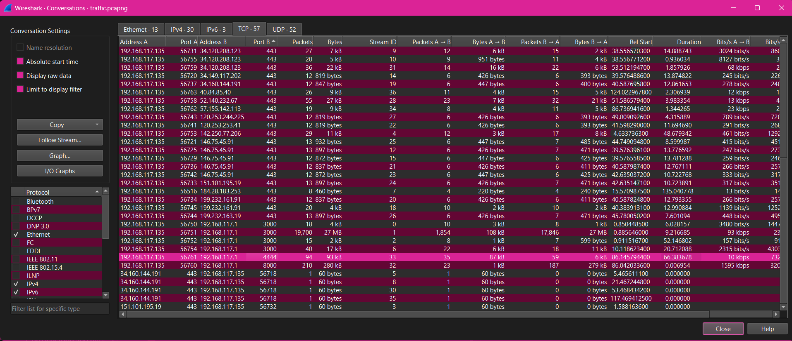

Port `4444` confirmed.

---

## Question 5 — Local file read by Updater.exe for encryption key material

**Question:** What local file does `Updater.exe` read before communicating with the C2 server, used as key material for encryption?

**Answer:** `C:\Windows\hh.exe`

### Solution

We opened `Updater.exe` in IDA Pro and let the autoanalysis finish. The binary imports `BCryptOpenAlgorithmProvider`, `BCryptGenerateSymmetricKey`, `BCryptEncrypt`, and `BCryptDecrypt` from `bcrypt.dll`, so AES encryption is happening somewhere. It also imports `connect`, `send`, and `recv` from `WS2_32` — classic reverse shell plumbing.

Interestingly, `CreateFileW` and `ReadFile` only show up in library helper functions, not in any user code. That's a red flag. We checked `main()` and found why: the binary resolves `CreateFileA` and `ReadFile` **dynamically** at runtime via `GetProcAddress`, storing the results in global function pointers.

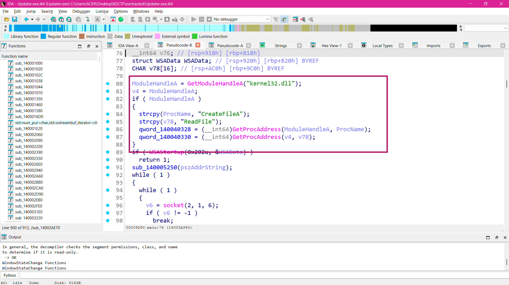

```c
strcpy(ProcName, "CreateFileA");
strcpy(v78, "ReadFile");
qword_140040328 = (__int64)GetProcAddress(ModuleHandleA, ProcName);
qword_140040330 = (__int64)GetProcAddress(v4, v78);
```

This is a simple trick to hide file I/O from static import analysis — the imports tab shows nothing, but the binary can still open and read files at runtime.

Cross-referencing those two globals (`qword_140040328`, `qword_140040330`) led us to `sub_140006A80`, which is called in `main()` right after the C2 connection is established. Inside, it calls the resolved `CreateFileA` pointer to open a file, checks the size is reasonable, allocates a buffer, then calls the resolved `ReadFile` pointer to read the entire contents into memory.

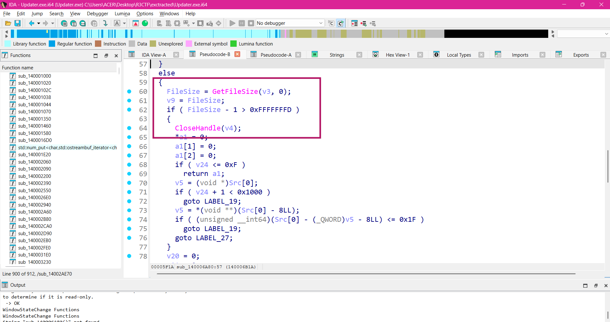

The file path isn't passed in as a parameter — `sub_140006A80` calls another function, `sub_1400053B0`, to build the path internally. That function constructs a string one character at a time by pushing integer literals onto a `std::string`. No string constant appears in the binary — another way to dodge static string searches.

Decoding the byte sequence:

```
67 58 92 87 105 110 100 111 119 115 92 104 104 46 101 120 101
 C  :  \   W   i   n   d   o   w   s   \   h   h  .   e   x   e
```

The path is `C:\Windows\hh.exe` — the Windows HTML Help executable that ships with every Windows install.

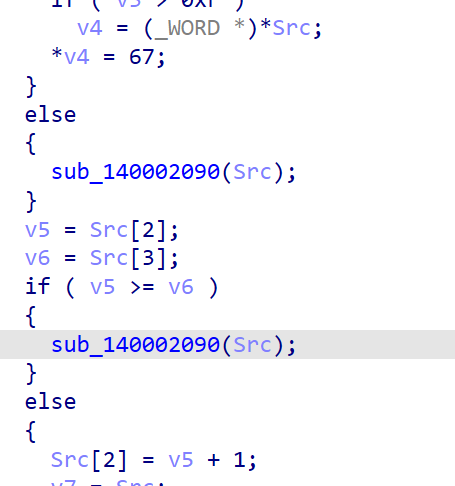

The file contents are then used in `main()` to build a 256-entry lookup table (`v74`), which maps each unique byte value found in `hh.exe` to its first occurrence index. This table is what gets passed into `sub_140006300` as the key material for AES decryption of C2 commands.

In short: `Updater.exe` reads `C:\Windows\hh.exe` and uses its byte distribution as an encryption key — a living-off-the-land approach where a legitimate, always-present system file acts as a shared secret between implant and server.

---

## Question 6 — Original MD5 hash of the file when read by Updater.exe

**Question:** What was the original MD5 hash of this file when it was read by Updater.exe?

**Answer:** `2c8fe78d53c8ca27523a71dfd2938241`

### Solution

Since `hh.exe` itself isn't in the forensic image, we recover it from what the malware already sent over the network.

`Updater.exe`'s exfil loop (in `main()`) is simple:
1. Read `hh.exe` into a heap buffer
2. Prepend a 4-byte big-endian length field
3. XOR every byte of the file content with the repeating key `0x1337c0de`
4. Send the whole thing to `192.168.117.1:4444`

So the PCAP contains the file, just obfuscated. We extract the victim→C2 TCP stream:

```bash
tshark -r traffic.pcapng \
  -Y "tcp.dstport == 4444 && ip.src == 192.168.117.135 && tcp.len > 0" \
  -T fields -e tcp.payload | tr -d '\n' | xxd -r -p > victim_to_c2.bin
```

Then decode with Python:

```python
import hashlib, struct

with open('victim_to_c2.bin', 'rb') as f:
    raw = f.read()

length = struct.unpack_from('>I', raw, 0)[0]   # 0x4800 = 18432 bytes
key = bytes.fromhex('1337c0de')
decoded = bytes(b ^ key[i % 4] for i, b in enumerate(raw[4:4+length]))

print(decoded[:2])          # b'MZ' — valid PE header, confirms correct decode
print(hashlib.md5(decoded).hexdigest())
```

Output:

```
b'MZ'
2c8fe78d53c8ca27523a71dfd2938241
```

The MZ header at offset 0 confirms we recovered a valid PE file. The 18432-byte blob is the exact `hh.exe` that was on Tsuki's machine at the time the malware ran.

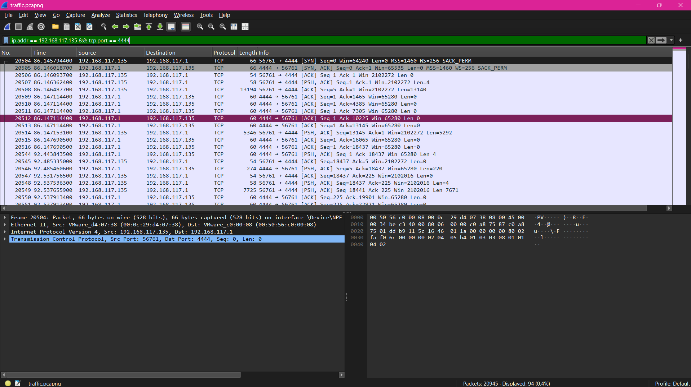

---

## Question 7 — First command issued by the attacker via C2

**Question:** After establishing the C2 connection, what was the first command issued and executed by the attacker via the C2 server?

**Answer:** `ipconfig /all`

### Solution

After sending the XOR'd `hh.exe`, `Updater.exe` enters a receive loop. The C2 server sends back 8 encoded command messages, each length-prefixed with a 4-byte big-endian integer. Each message body is an ASCII string of dot-separated signed decimal integers — each integer is the first-occurrence index of a byte value in `hh.exe`. The malware decodes these by looking up each index in a 256-entry table it built from the file, then executes the resulting command string via `sub_140006720`.

We confirmed this with x64dbg dynamic analysis. Setup:

**Step 1 — Load and set breakpoints**

`Updater.exe` was opened in x64dbg. Three breakpoints were placed:

| Address | Purpose |
|---|---|
| `0x7FF6C0FAAADF` | `call [connect]` — redirect C2 IP |
| `0x7FF6C0FA6B0B` | `call [CreateFileA]` — redirect hh.exe path |
| `0x7FF6C0FA6720` | command executor — read decoded command |

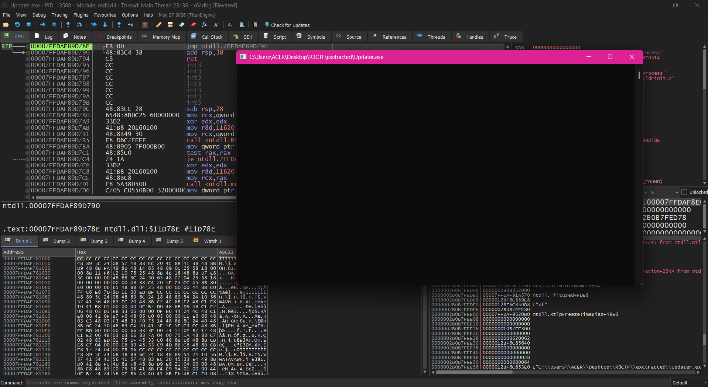

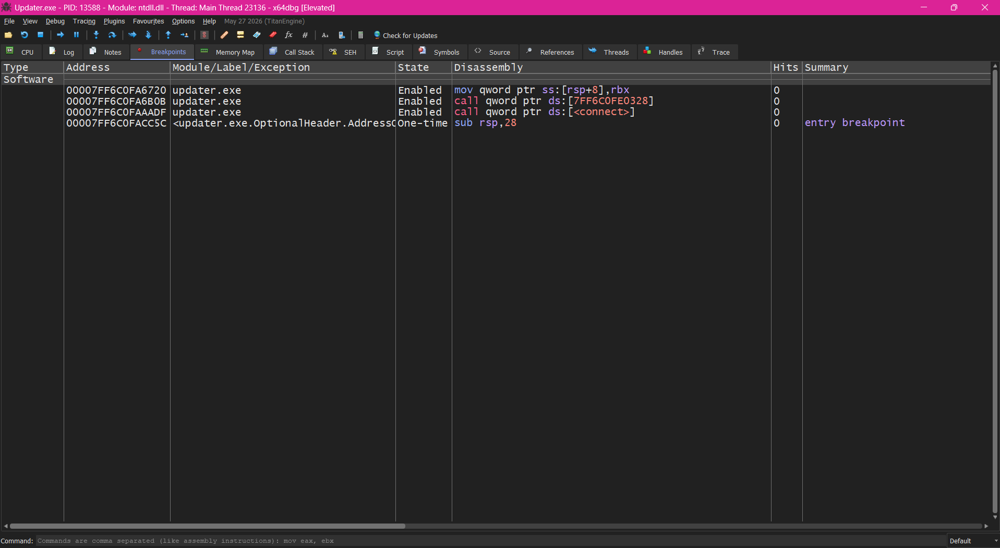

**Step 2 — Replay server**

A Python replay server was written to listen on `127.0.0.1:4444`, receive the XOR'd `hh.exe` upload, verify its MD5, then replay all 8 original C2 messages from the PCAP.

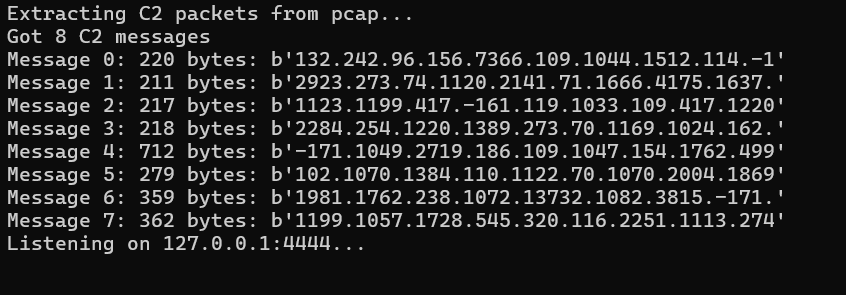

**Step 3 — Redirect C2 connection**

At the connect BP, `RDX` points to the `sockaddr_in` struct. The IP field at offset `+4` contains `c0 a8 75 01` (192.168.117.1 — the real C2). We overwrote it with `7f 00 00 01` (127.0.0.1) so the malware connects to our replay server instead.

![x64dbg paused at connect BP — call [connect] highlighted, RDX pointing to sockaddr](photos/qsn7-4.png)

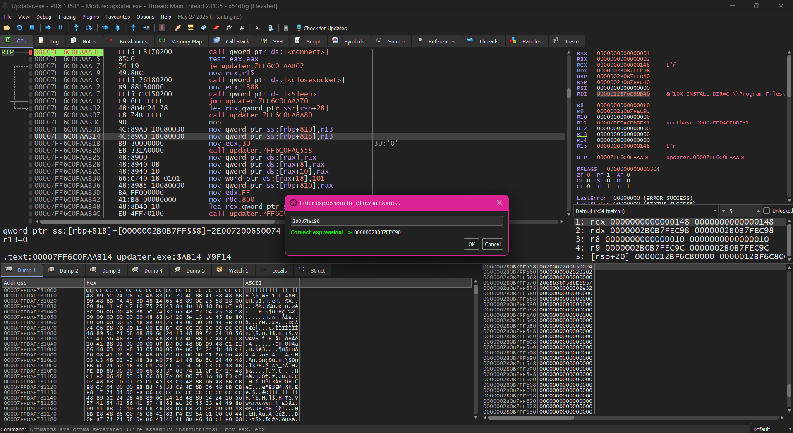

**Step 4 — Redirect hh.exe path**

At the CreateFileA BP, `RCX` contains the heap pointer to the path string `C:\Windows\hh.exe`. The system's `hh.exe` (40960 bytes) differs from Tsuki's (18432 bytes), so the lookup table would be wrong. We copied Tsuki's recovered `hh.exe` to `C:\Users\ACER\hh.exe` and overwrote the path in memory with the new path bytes (`43 3A 5C 55 73 65 72 73 5C 41 43 45 52 5C 68 68 2E 65 78 65 00`).

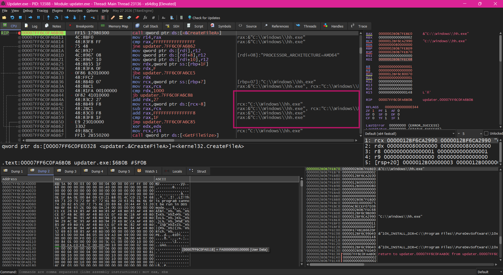

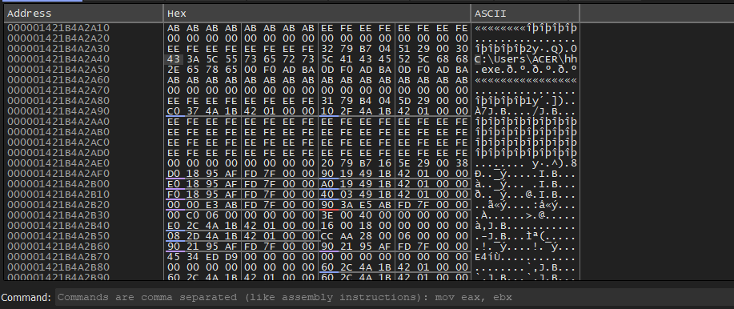

**Step 5 — Connection established, hh.exe received**

After resuming, the malware connected to `127.0.0.1:4444`, sent the XOR'd `hh.exe`, and the replay server confirmed MD5 `2c8fe78d53c8ca27523a71dfd2938241` — Tsuki's correct `hh.exe` — then sent all 8 C2 messages back.

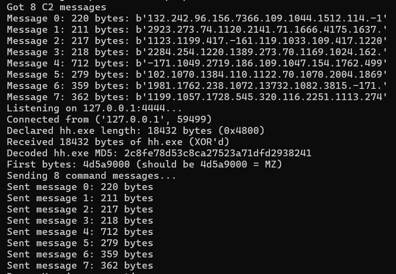

**Step 6 — Command executor hit**

The malware decoded the first C2 message using the lookup table and called `sub_140006720`. We hit the BP there. At this point `R8` in the hints panel already shows a preview of `\r\nWindows IP Configuration\r\n` — the output of `ipconfig /all` being prepared to send back. The right-hand stack/reference panel confirms the full string.

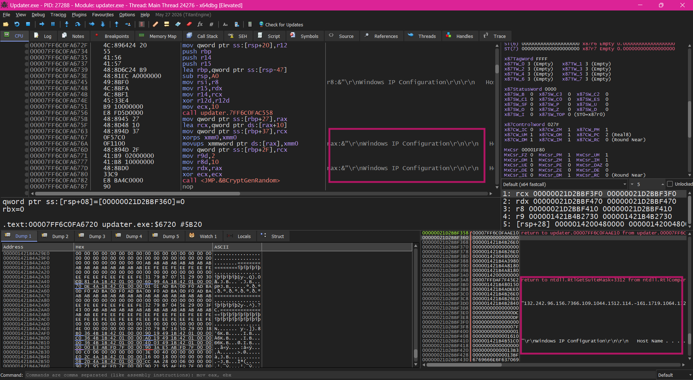

The decoded first command was `ipconfig /all`. Its output — hostname `DESKTOP-HRP7SJJ`, all adapter info — was assembled in memory and sent back to the C2 server.

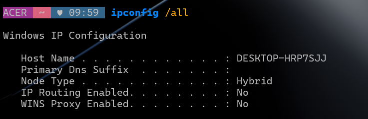

**Answer: `ipconfig /all`**

---

## Question 8 — Return result of the whoami command

**Question:** What was the return result of the `whoami` command executed by the attacker?

**Answer:** `desktop-gb98l3m\tsuki`

### Solution

#### Reversing the C2 encoding scheme

The C2 traffic is not just indexed lookups into `hh.exe` — the full encoding scheme needed to be reversed to decrypt both commands and their responses.

In IDA Pro, `sub_140004D80` (the parser called by the C2 decoder) reveals the exact logic. At line 111, it checks whether the first byte of each token equals `45` — the ASCII code for `-`:

```c
if ( *(_BYTE *)v13 == 45 )   // token starts with '-'
{
    // Negative: strip the '-', parse remaining digits, use that integer directly as the byte value
    v19 = strtol(v17, EndPtr, 10);
    *v21 = v19;
}
else
{
    // Positive: parse as unsigned 64-bit index, walk the lookup tree built from hh.exe,
    // find the node whose key equals this index, and use its stored byte value
    v25 = sub_140015900(v24, &v34, 10);
    // ... tree walk ...
    *v28 = *(_BYTE *)v12;   // byte from hh.exe at that index
}
```

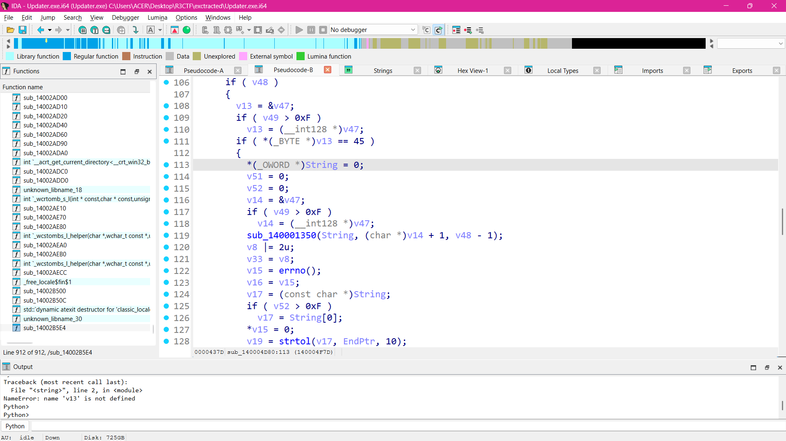

So the encoding scheme is:
- **Positive integer** → index into `hh.exe`; the byte at that position is the decoded value
- **Negative integer** → the absolute value **is** the byte directly (e.g. `-161` → byte `0xa1`)

This scheme applies to **both** C2→victim (commands) and victim→C2 (responses). All traffic is encoded then AES-CBC encrypted, with the decoded byte stream structured as: `key (16 bytes) || ciphertext || iv (16 bytes)`.

#### Decrypting all commands and responses

With the correct scheme, we wrote a decoder using Tsuki's recovered `hh.exe` and extracted all 8 commands from the PCAP:

```python
with open('tsuki_hh.exe', 'rb') as f:
    hh = f.read()

def decode(s):
    out = bytearray()
    for num in s.strip().split('.'):
        n = int(num)
        out.append(-n if n < 0 else hh[n])
    return AES.new(bytes(out[:16]), AES.MODE_CBC, bytes(out[-16:])).decrypt(bytes(out[16:-16]))
```

Running against the C2→victim messages:

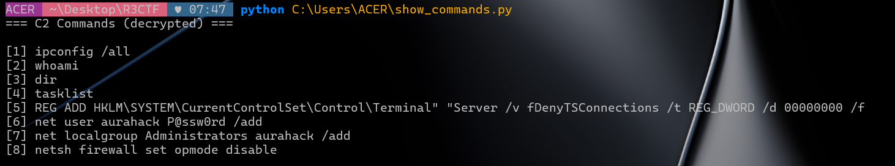

```
[1] ipconfig /all
[2] whoami
[3] dir
[4] tasklist
[5] REG ADD HKLM\SYSTEM\CurrentControlSet\Control\Terminal" "Server /v fDenyTSConnections /t REG_DWORD /d 00000000 /f
[6] net user aurahack P@ssw0rd /add
[7] net localgroup Administrators aurahack /add
[8] netsh firewall set opmode disable
```

The same decoder applied to victim→C2 response traffic decrypts the `whoami` output (response #2):

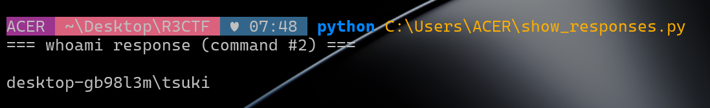

Tsuki's machine hostname is `DESKTOP-GB98L3M` and the logged-in user is `tsuki`.

**Answer: `desktop-gb98l3m\tsuki`**

---

## Question 9 — New user created by the attacker

**Question:** The attacker created a new user on the victim's computer. What are the username and password of this user?

**Answer:** Username: `aurahack` / Password: `P@ssw0rd`

### Solution

From the full command list decoded in Q8, command 6 is:

```
net user aurahack P@ssw0rd /add
```

This creates a local Windows user account with username `aurahack` and password `P@ssw0rd`. No further analysis needed — the credentials are plaintext in the decrypted C2 command.


**Answer: `aurahack` / `P@ssw0rd`**

---

## Question 10 — 7th word of the MetaMask wallet seed phrase

**Question:** By analyzing the retrieved files, what is the 7th word of the MetaMask wallet seed phrase saved by the victim?

**Answer:** `faint`

### Solution

After solving Q9, the CTF provided `Evidence.zip` with password `18ae3a54-1c1a-4f44-adca-9884acb80d9a`. Extracting it yields a single file: `Cache0000.bin` (48 MB).

The `RDP8bmp` magic header identifies this as a **Windows RDP bitmap cache** file — tiles of screen content cached during the attacker's RDP session (which they enabled via the `REG ADD ... fDenyTSConnections` command in Q7). These tiles contain fragments of whatever was visible on Tsuki's screen during the RDP session.

We used [bmc-tools](https://github.com/ANSSI-FR/bmc-tools) (ANSSI-FR) to extract and reassemble the tiles into a collage:

```
python bmc-tools.py -s Cache0000.bin -d bmc_out -b
```

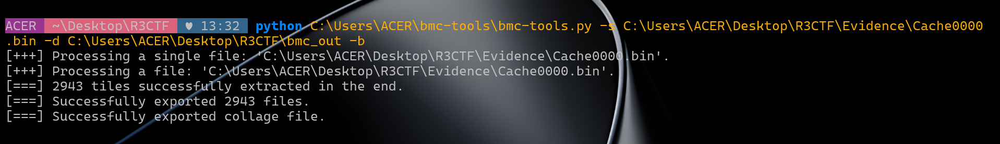

This produced a 4096×2944 collage BMP from 2943 cached screen tiles:

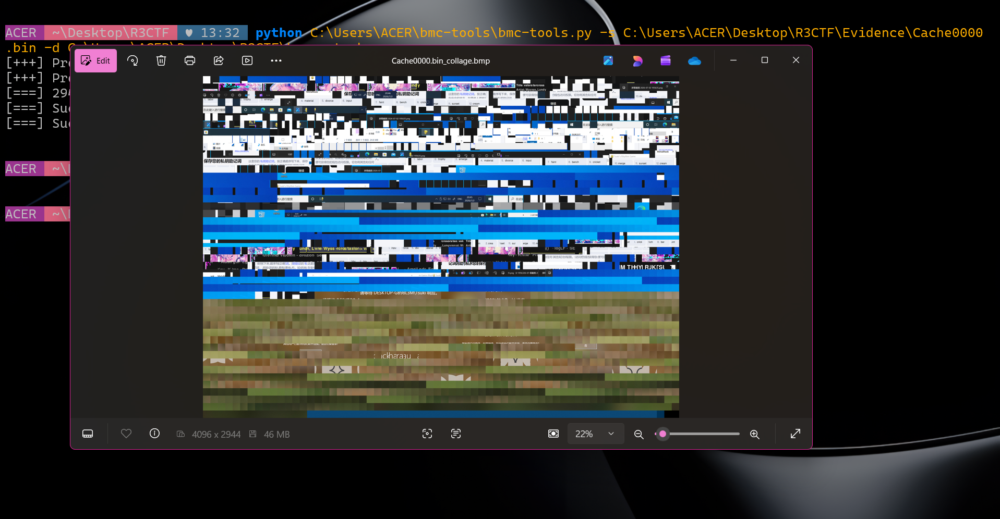

Examining the collage closely, a MetaMask "Save your Secret Recovery Phrase" dialog is visible in the top strip, showing all 12 seed words in numbered order:

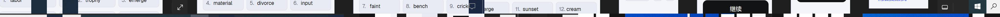

```
1. labor    2. trophy   3. emerge   4. material   5. divorce   6. input
7. faint    8. bench    9. cricket  10. merge     11. sunset   12. cream
```

The 7th word is **`faint`**.

---

## Question 11 — Victim's Ethereum wallet address

**Question:** What is the victim's Ethereum wallet address?

**Answer:** `0x27A2481a2D840C64c1f6a99842E1A63A1586237e`

### Solution

With all 12 seed words recovered from the RDP bitmap cache, the Ethereum wallet address is deterministically derivable using standard BIP-39/BIP-44 derivation (path `m/44'/60'/0'/0/0`).

```python
from eth_account import Account

Account.enable_unaudited_hdwallet_features()

mnemonic = "labor trophy emerge material divorce input faint bench cricket merge sunset cream"
acct = Account.from_mnemonic(mnemonic)
print("Ethereum wallet address:", acct.address)
```

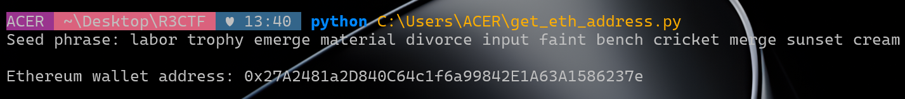

The `eth_account` library handles BIP-39 mnemonic → seed → BIP-44 HD key derivation internally, producing the first account address at the standard Ethereum derivation path.

**Answer: `0x27A2481a2D840C64c1f6a99842E1A63A1586237e`**

---

## Flag

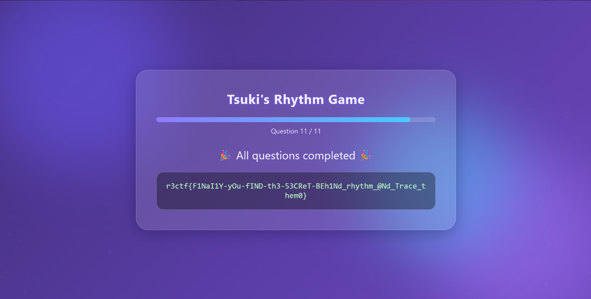

```
r3ctf{F1NaI1Y-yOu-fIND-th3-53CReT-BEh1Nd_rhythm_@Nd_Trace_them0}
```
